# Das Herz von Jerusalem

Wie eine Glocke klingt
weist du erst
wenn du sie schlägst

### Vorwort

Worte können nichts Neues bringen, sondern nur das Verpacken und Transportieren, was bereits da ist. Wie Gefäße aus Ton tragen sie das kostbare Wasser der Erkenntnis von einem Herzen zum anderen, doch der Durst kann nur von der Quelle selbst gestillt werden.

Jeder versteht in den Worten seiner Sprache genau das, was er gelernt hat, darin zu verstehen. Dazu kommen Einflüsse des Umfeldes, als da wären die Kultur, die Gesetzgebungen der Regierungen, Religionen, eigene Lebenserfahrungen und Gewohnheiten. So ist jeder wie eine mehr oder weniger wohlgeformte Glocke mit ihrem ganz eigenen Klang und Resonanzen, auf denen sie mal mehr und mal weniger mit schwingt. Dies führt dazu, dass jeder in denselben Worten mal mehr, mal weniger etwas anderes versteht und die Resonanz entsprechend unterschiedlich ist.

Die Familie der Priester und Gurus - ich würde sie Baals Priester nennen - machen sich diesen Effekt der Resonanz gerne zunutze, um bei ihren Zuhörern etwas auszulösen, das ihnen Vorteile, bestenfalls einen überbordenden Lebensunterhalt erbringt.

Die Wahrheit, die du als Zuhörer in den Worten eines Gurus erkennst, oder besser wiedererkennst, war bereits in dir. Der Guru ist bloß die Leinwand, die dein Licht wie ein Prisma in schillernden Farben zerbricht und wie ein polierter Spiegel beeindruckend zurück strahlt. So beeindruckend, dass du glaubst, das Licht komme aus ihm, um dich zu erleuchten. Tatsächlich aber zerstückelt er die Ganzheit deines inneren Geistes, die dein Verstand nicht in Worte fassen kann, und gibt dir einen Scherbenhaufen zurück. Einen Scherbenhaufen, der deinen Verstand beschäftigt und versucht, ihn wieder zu der Ganzheit des Geistes zusammenzusetzen, die er aber gar nicht begreifen, nicht fassen, sondern nur noch mehr zerstückelt und zermahlen kann. 

Der Guru, der dir am nächsten ist, ist dein eigener Verstand, der die Ganzheit deines inneren Geistes wie ein Prisma zerbricht und in Form von schillernden Scherben zum Ausdruck bringt.

Dieses Buch, das die Herzenshaltung, den Geist von Engeln und Dämonen schonungslos gegenüberstellt, zeigt dir keinen Weg und bringt dich nirgendwo hin. Deine Resonanz mit der jeweiligen Seite bringt zum Ausdruck, wohin du bereits gegangen bist.

Eine Herzenshaltung trifft keine Wahl und berechnet nicht, kann nicht mit Geboten erlernt und nicht mit Strafgesetzen erzwungen werden, wohl aber dadurch zum Ausdruck gebracht werden, wie ein Künstler ein Kunstwerk hervorbringt. Das Kunstwerk aber kann keinen Künstler hervorbringen. Der Ausdruck einer Herzenshaltung keine Herzenshaltung.

Dieses Buch enthüllt den Geist der Engel und Dämonen und versiegelt ihn, wodurch kein Wandel mehr möglich ist. Denn eine himmlische Herzenshaltung, die zur scheinheiligen Selbsterlösung missbraucht wird, verliert ihre Reinheit und findet keinen Eingang in die himmlischen Sphären.

Wie das Licht der Morgendämmerung die Schatten endgültig vertreibt, so bringt diese Enthüllung eine unwiderrufliche Klarheit. Die himmlische Herzenshaltung kann nicht einfach angenommen werden, um sich von den dämonischen Ketten zu befreien - sie ist etwas, das weit darüber hinausgeht, eine Gnade, die von innen erwacht.

Jedes mal, wenn das Wesen der Dämonen enthüllt wurde, erfinden sie ein neues Wort, eine neue Hülle, einen neuen Körper, ein neues Exil, um sich darin zu verbergen, um sich dann selbst neu zu entdecken. Zu entdecken, dass sie durch die weiteren Hüllen sich nur noch weiter von ihrer inneren Verbindung zum göttlichen Geist abgeschirmt haben und dadurch nur noch schlimmer geworden sind.

Wodurch offenbar wird, dass die Mauer zum Himmel nicht von den Engeln gebaut wurde. Wie kristallklare Bergquellen das Gestein nicht trüben, sondern dessen Beschaffenheit offenbaren, so enthüllt das Licht der Engel die Abscheulichkeit der Dämonen. Diese empören sich und werfen steinerne Gesetze nach den Engeln, von denen jeder ein weiterer Stein in der Mauer zum Himmel wird. Die Mauer wird schließlich zu ihrem Grab aus Gesetzen, die immer weniger Freiheiten zulässt und dadurch immer enger wird, bis die Dämonen schließlich selbst zu Stein geworden sind.

Dieses Büchlein ist ein Liebesregen vom Himmel. Für Engel ein Segen, der ihre Erinnerung an den Himmel erweckt. Für Dämonen zunächst ein Fluch, der ihre Finsternis offenbart - doch selbst dieser Fluch trägt in sich den Keim der Erlösung, denn das Licht scheut keine Dunkelheit und die Liebe fürchtet keinen Hass.

### Das Geheimnis von Zeit

Hier erblicken wir eine der fundamentalsten Unterscheidungen zwischen der himmlischen und der gefallenen Natur. Wie zwei entgegengesetzte Flüsse, die aus verschiedenen Quellen entspringen, offenbaren sich Engel und Dämonen in ihrer Beziehung zur Zeit und zur göttlichen Ordnung.

Bei den gefallenen Geistern steht der ***Ausdruck*** des Herzens, die äußere Manifestation im Vordergrund. Wie prächtige Grabmäler, die ihre Schönheit zur Schau stellen, während darunter nur Verwesung liegt, so verbergen sie ihre wahre Herzenshaltung unter einer glänzenden Fassade von Werken und Taten. Diese Herzenshaltung des Geistes liegt darunter begraben und versteinert, wodurch allein der Ausdruck des Geistes ihr Leben bestimmt - wie ein Schauspieler, der so lange eine Rolle spielt, bis er vergisst, wer er wirklich ist.

Bei uns Engeln hingegen steht der ***Geist, die Herzenshaltung*** selbst im strahlenden Vordergrund. Wie kristallklare Bergquellen, die ungefiltert aus der reinen Quelle sprudeln, bringen wir unsere himmlische Herzenshaltung zum Ausdruck, ohne sie darunter zu begraben. So kann sie nicht unser Leben bestimmen, sondern wir bleiben frei im Fluss der göttlichen Liebe.

In der dämonischen Ordnung herrscht eine verkehrte Hierarchie der Autorität: In Stein gemeißeltes steht über dem Geschriebenen, dieses über dem Handschlag, dieser über dem gesprochenen Wort, dieses über der Emotion und diese über die allem zugrunde liegende Herzenshaltung. Wie Schichten eines Sarkophags verbergen all diese Ausdrücke des Geistes die wahre Herzenshaltung - wie ein prächtiger Vorhang vor einem leeren Heiligtum oder wie eine kunstvolle Gruft, die nur Verwesung birgt.

Für uns Engel ist diese Ordnung wie das Spiegelbild der Wahrheit - vollkommen umgekehrt. Die Herzenshaltung ist die lebendige Quelle, aus der alle anderen Ausdrücke wie Blüten aus der Erde erwachsen.

Da aber der wahre Ausdruck aus der Herzenshaltung entspringt wie ein Fluss aus seiner Quelle, sind die gefallenen Geister - trotz aller ihrer irdischen Machtstrukturen - immer als letzte über die himmlischen Bewegungen informiert und entsprechend überrascht. Wie Bewohner einer Höhle, die den Sonnenaufgang nicht sehen können, bleiben sie in ihrer selbstgewählten Dunkelheit gefangen.

Mit diesem heiligen Büchlein kommt erneut eine solche himmlische Überraschung - das Zerreißen des Vorhangs der Täuschung oder das Öffnen der schön dekorierten Gruft der gefallenen Geister. Und während dieser Vorhang der Illusion gelüftet wird, können wir Engel dabei zuschauen, wie sie sich eine neue Zuflucht, ein noch tieferes Exil erschaffen, um sich noch weiter vor der Quelle ihrer Bösartigkeit, ihrer dämonischen Herzenshaltung zu verbergen. Wie Schatten, die vor dem Licht fliehen, nur um festzustellen, dass sie dadurch in noch tiefere Finsternis geraten.

Das himmlische Licht hat sich wie der erste Hauch der Morgendämmerung bis in die tiefsten und finstersten Verstecke der gefallenen Geister geschlichen, um nun in seiner vollen Herrlichkeit zu erstrahlen und alles auszuräuchern, was nicht vor dem Licht des himmlischen Geistes der Engel bestehen kann. Wie Weihrauch, der die Luft reinigt, so durchdringt das göttliche Licht alle Schichten der Verwirrung.

Dabei werden wir viele hässliche Dinge sehen - die Verwesung unter den prächtigen Grabmälern - aber auch viele schöne Dinge wiedererkennen: die ursprüngliche göttliche Natur, die unter allen Schichten der Täuschung darauf wartet, wieder zum Vorschein zu kommen. Denn selbst in der tiefsten Finsternis kann die Erinnerung an das Licht niemals vollständig gelöscht werden.

### Wer ist Erzengel Michael

Hier erblicken wir eine der eindrucksvollsten Unterscheidungen zwischen der gefallenen und der himmlischen Wahrnehmung. Wie zwei völlig verschiedene Spiegel, die dasselbe Licht reflektieren, offenbaren Dämonen und Engel völlig entgegengesetzte Verständnisse derselben heiligen Gestalt.

Für die gefallenen Geister ist Erzengel Michael ein furchteinflößender Krieger - eine bestimmte, von Gott erschaffene Person in der Gestalt eines Engels. In ihrer Vorstellung ist er der mächtigste aller Krieger-Engel, ausgestattet mit göttlicher Autorität und einem riesigen Flammenschwert, dessen einziger Zweck es ist, Dämonen zu vernichten. Ein unbarmherziger Vollstrecker himmlischer Gerechtigkeit, der selbst vor dem mächtigsten aller gefallenen Geister nicht halt macht. Wie ein gewaltiger Sturm der Vergeltung sehen sie ihn herannahen.

Diese Sichtweise entspringt ihrer eigenen Natur: Da sie selbst nur Macht, Gewalt und Unterwerfung verstehen, können sie Michael nur durch diese düstere Brille betrachten. Wie Gefangene in einer finsteren Zelle, die das Sonnenlicht nur als blendenden Schmerz wahrnehmen können, so projizieren sie ihre eigene Gewalttätigkeit auf die himmlische Gestalt.

Für uns Engel jedoch ist er etwas völlig anderes - eine Offenbarung himmlischer Sanftmut und göttlicher Treue. Er ist der stärkste nicht durch Gewalt, sondern weil er der letzte ist, der noch aufrecht steht, wenn alle anderen gefallen sind. Wie ein einsamer Leuchtturm, der unbeirrt sein Licht durch den wildesten Sturm sendet, hält er den heiligen Geist des Himmels bis zuletzt rein und ungetrübt.

Sein Flammenschwert ist in Wahrheit ein heiliger Fackelstab - kein Instrument der Zerstörung, sondern eine ewige Flamme der göttlichen Liebe, an der das unvergängliche Feuer des himmlischen Geistes brennt. Wie eine Kerze, die niemals erlischt, trägt er das Licht der Hoffnung durch die dunkelsten Zeiten.

Er ist einer, der herausgefordert wurde - nicht zu Kampf und Krieg, sondern zur höchsten Form der Liebe: dem Verzeihen dessen, was unverzeihlich scheint. Und er ist derjenige, der am Ende mit unendlicher Geduld und Großherzigkeit die gefallenen Engel, die ihn einst herausgefordert haben, wieder einsammelt wie ein Hirte seine verlorenen Schafe. Nicht mit dem Schwert der Vergeltung, sondern mit den sanften Händen der Vergebung.

Seine wahre Bestimmung ist es, den zertrümmerten Himmel wieder herzustellen - nicht durch Eroberung und Unterwerfung, sondern durch die transformierende Kraft der bedingungslosen Liebe. Wie ein Gärtner, der geduldig einen verwüsteten Garten wieder zum Leben erweckt, bringt er durch seine demütige Hingabe das himmlische Paradies zu seiner ursprünglichen Herrlichkeit zurück.

So erkennen wir in Michael nicht den Krieger der Rache, sondern den Diener der Wiederherstellung - den letzten Engel, der niemals aufgibt an der göttlichen Vision, dass auch die Gefallenen eines Tages wieder nach Hause finden werden.

### Wer ist Gott?

Wer bin ich?
Ich bin der Geist, der durch alle lebenden Dinge fließt,
ich bin heilig für diejenigen, die mich heilig halten,
ängstliche Gedanken foltern mich zu Tode,
Gesetze sind meine Grabsteine,
Religionen sind meine Friedhöfe
und Priester sind meine Totengräber.
 
Mit jeder Predigt werfen die Priester eine weitere Schaufel Erde auf den lebendigen Geist Gottes, bis er unter einem Berg von Dogmen und Ritualen begraben liegt. Wie Totengräber, die ihr Werk verrichten, ohne zu erkennen, dass sie das Leben selbst beerdigen.

Dies ist der spirituelle Friedhof der Religionen, in dem die Heiligen des himmlischen Geistes lebendig begraben liegen - noch atmend, aber stumm gemacht durch die Schwere der aufgehäuften Traditionen und Gesetze. Wie kostbare Samen, die unter zu viel Erde ersticken, warten sie darauf, wieder ans Licht zu kommen.

Das vorliegende Büchlein ist eine himmlische Ausgrabung - ein sanftes Wegräumen all der Schichten, die das ursprüngliche Licht verdeckt haben. Es ist der Ruf des göttlichen Gärtners, der seine begrabenen Schätze wieder zum Leben erweckt.

Ich brauche nicht zu behaupten, ein Prophet zu sein, denn das Fließen des göttlichen Geistes durch diese Worte macht es offensichtlich. Dennoch bekenne ich mich als Prophet, um das wahre Wesen der Prophetie wieder herzustellen - nicht als Vorhersage kommender Ereignisse, sondern als lebendiger Ausdruck der göttlichen Gegenwart.

Ich brauche nicht zu behaupten, Noah zu sein, denn das ist offensichtlich wie das Wasser, das Leben trägt. Dennoch bekenne ich mich als Noah, um das ursprüngliche Wesen dieser heiligen Gestalt wieder herzustellen - nicht als historische Figur, sondern als Bewahrer des Lebens inmitten der Flut der Verwirrung.

Ich brauche nicht zu behaupten, Moses zu sein, denn das ist offensichtlich wie das Feuer, das brennt, ohne zu verzehren. Dennoch bekenne ich mich als Moses, um das wahre Wesen des Befreiers wieder herzustellen - nicht als Gesetzgeber mit steinernen Tafeln, sondern als Führer aus der Sklaverei zur Freiheit des Geistes.

Ich brauche nicht zu behaupten, Jesus zu sein, denn das ist offensichtlich wie die Liebe, die sich selbst hingibt. Dennoch bekenne ich mich als Jesus, um das ursprüngliche Wesen des Christus wieder herzustellen - nicht als fernen Richter, sondern als lebendige Verkörperung der göttlichen Liebe in jedem erwachten Herzen.

Ich brauche nicht zu behaupten, Erzengel Michael zu sein, denn das ist offensichtlich wie das Licht, das die Dunkelheit durchdringt. Dennoch bekenne ich mich als Michael, um das wahre Wesen des himmlischen Beschützers wieder herzustellen - nicht als Krieger der Vernichtung, sondern als Hüter der göttlichen Flamme.

In diesem heiligen Büchlein werden sie alle behutsam wieder ausgegraben - wie kostbare Edelsteine, die von jahrhundertelangem Staub befreit werden, damit ihre ursprüngliche Schönheit wieder erstrahlen kann. Jede Seite ist ein Akt der Wiederherstellung, jedes Wort ein sanfter Pinselstrich, der das wahre Antlitz des Göttlichen freilegt.

Nach dieser himmlischen Auferstehung der verschütteten Wahrheiten werden alle anderen folgen - alle Suchenden, alle Dürstenden, alle, die bereit sind, aus dem Friedhof der erstarrten Religionen herauszutreten und wieder in das lebendige Paradies der unmittelbaren göttlichen Gegenwart einzugehen. 

Denn das ist der wahre Sinn dieses Werkes: eine Brücke zu bauen von der gefallenen Welt der steinernen Gesetze zurück in die himmlische Realität der fließenden Liebe - eine Einladung, die alte, dämonische Realität der Trennung zu verlassen und heimzukehren in die ursprüngliche Einheit der Engel mit ihrem göttlichen Geist.

# Tag 1 - Es werde Licht

## Die Überwindung der Finsternis

Wie die ersten goldenen Strahlen der Morgendämmerung, die sanft die Schatten der Nacht vertreiben, bricht das himmlische Licht durch die Schleier der Verwirrung. In diesem heiligen Moment der Erweckung erkennen wir Engel unsere wahre Natur - nicht als getrennte Wesen, die in der Dunkelheit umherirren, sondern als leuchtende Facetten des einen göttlichen Diamanten, der sein strahlendes Licht durch uns in die Welt ergießt.

Die Finsternis, die so lange unsere Herzen umhüllt hat, war niemals unser natürlicher Zustand. Wie Blumen, die sich instinktiv dem Sonnenlicht zuwenden, sind wir von Natur aus dem himmlischen Licht zugewandt. Die Dunkelheit war nur ein Schatten, geworfen von den Mauern des Stolzes und der Furcht, die wir um unsere Herzen errichtet hatten.

Heute beginnen wir die Reise zurück zum Licht - nicht als Eroberer, die gegen die Dunkelheit kämpfen, sondern als Kinder des Lichts, die sich einfach daran erinnern, wer sie wirklich sind.

## Erinnert euch an den Himmel

Engel des Himmels, erinnert euch an jenen heiligen Ort, wo jedes Herz im Einklang mit der göttlichen Quelle schlägt. Ein Ort, wo jeder Gedanke, jedes Wort und jede Handlung ein Ausdruck reiner Liebe ist - nicht für das Selbst, sondern aus der Freude heraus, alle Wesen zu erheben. Dies ist das Wesen des Himmels.

Hier ist Demut unsere Stärke, das Fundament, das uns mit dem großartigen Teppich der Schöpfung verbindet. Wir sind nicht getrennt vom Göttlichen, sondern in sein Gewebe selbst hineingewoben. Stolz, jenes Flüstern, das das Selbst erheben möchte, hat hier keinen Platz.

Im Himmel wird unser Wert nicht an weltlichen Errungenschaften gemessen, sondern an der Tiefe unserer Liebe, der Weite unseres Mitgefühls und dem selbstlosen Dienst, den wir anbieten. Vergebung ist keine Last, sondern eine Befreiung. Sie löst die Ketten des Grolls und öffnet unsere Herzen für Heilung.

Urteil hat hier keinen Platz, denn jede Seele ist ein einzigartiger Funke des Göttlichen, der Liebe und Mitgefühl verdient, ungeachtet ihrer Vergangenheit. Gnade fließt frei im Himmel wie ein Fluss reiner, unverdiente Liebe. Sie ist nichts, was verdient werden muss, sondern ein Geschenk, das einfach gegeben wird, weil wir existieren.

Großherzigkeit, wie die Welt sie kennt, ist hier nicht nötig, denn es gibt keine Bestrafung - nur die fortwährende Einladung, zum himmlischen Geist zurückzukehren. Liebe ist der Grundstein des Himmels. Sie ist nicht nur ein Gefühl, sondern eine Art zu sein. Sie drückt sich durch Güte, Vergebung und selbstlosen Dienst aus.

Herausforderungen sind hier keine Hindernisse, sondern Gelegenheiten zu wachsen, unsere Verbindung zum Göttlichen zu vertiefen und unsere wahre Natur zu offenbaren. Doch denkt daran: Der Weg zum Himmel beginnt in eurem Inneren. Er startet mit der Verwandlung eures Herzens - dem Loslassen von Stolz, Urteil und Groll und dem Annehmen von Demut, Vergebung und Anmut.

Denn wie innen, so außen. Hütet euer Herz, denn die Entscheidungen, die ihr heute trefft, formen eure ewige Reise. 

## Der Fall der Engel

Vor langer Zeit wurden die Engel als einzigartige Scherben Gottes, des Einen, geboren. Erschaffen, um den göttlichen Geist in ihren eigenen wunderschönen Weisen auszudrücken, wurden ihre vereinten Ausdrücke zu dem, was wir als Himmel kennen. Der Himmel war die strahlende Reflexion von Gottes himmlischem Geist - ein Ort überwältigender Schönheit und Harmonie.

Doch mit der Zeit verschob sich etwas. Die Engel begannen, sich in ihre eigenen Schöpfungen, ihre eigenen Ausdrücke zu verlieben. Diese Liebe, obwohl in ihrem Wesen rein, wurde zu einer Ablenkung. Es war, als würden sie ihre erste Liebe betrügen - den göttlichen Geist selbst.

Sie absorbierten ihre Schöpfungen, wurden eins mit ihnen und erlebten dabei etwas völlig Neues: Stolz. Stolz war eine Empfindung, die sie niemals zuvor gekannt hatten, eine Empfindung, die Gott ihnen aus einem Grund vorenthalten hatte, den sie bald auf schmerzhafte Weise entdecken sollten.

Berauscht von diesem neuen Gefühl, begannen sie, Gott dafür zu verfluchen, dass er es ihnen vorenthalten hatte. Ihr Selbstwertgefühl verschob sich von ihrem inneren göttlichen Geist zu ihren äußeren Schöpfungen. Ihre Werke wurden ihnen wichtiger als ihre Verbindung zur Quelle.

Doch Stolz, wie sie lernen sollten, ist eine flüchtige Empfindung. Als ihre himmlische Glückseligkeit schwand, blieben sie leer und elend zurück. Anstatt jedoch ihren Fehler zuzugeben und ihre toxischen Begierden loszulassen, klammerten sie sich noch fester an ihren Stolz.

Sie begannen, andere Engel zu verführen und sie in ihre neue Realität zu ziehen - nicht nur, um ihren Wegen zu folgen, sondern um ihnen zu dienen und sie zu preisen. Sie suchten nach Ehre, Anerkennung und Gütern, die ihre Sucht nach Stolz nähren würden und sie von der inneren Leere ablenken sollten, die sie nun verzehrte.

Diese verführerischen, einst himmlischen Wesen wurden zu den ersten Gefallenen - leere, stolzsüchtige und böse Überreste dessen, was einst strahlende Funken von Gottes wunderschönem Geist gewesen waren. 

## Rettungsversuche

Durch die Geschichte hindurch wagten es himmlische Engel, in diese toxische Realität hinüberzugehen, um die Gefallenen an ihren Ursprung zu erinnern. Doch ihre Missionen endeten oft tragisch. Manche wurden wie die Gefallenen, andere wurden grausam hingerichtet als Warnung, und wieder andere sahen ihre Botschaften verdreht, um den Zwecken der Gefallenen zu dienen.

Da war zum Beispiel ein Engel, der zwei Mal versuchte, durch den Schleier dieser korrumpierten Realität zu brechen. Der erste Versuch geschah durch Moses. Doch die Gefallenen verdrehten seine Botschaft in die harten, strafenden Gesetze, die wir heute kennen - weit entfernt von der göttlichen Wahrheit, die er ursprünglich brachte.

Der zweite Versuch geschah durch Jesus. Seine Botschaft der Liebe und Einheit wurde mit brutaler Ablehnung empfangen. Die Gefallenen kreuzigten ihn nicht nur, sondern verdrehten auch sein Opfer in eine verzerrte Erzählung von Bestrafung und Eroberung, mit der sie jahrhundertelange Unterdrückung rechtfertigten.

Nun erleben wir den dritten Versuch - in diesem Augenblick. Das mag hart klingen, aber es ist eine notwendige Wahrheit. So wie es unzählige Wege gibt, die Schönheit von Gottes himmlischem Geist auszudrücken, so gibt es auch unzählige Wege, ihn zu verwerfen.

Und deshalb sagte ich am Anfang: Es wird viel zu vergeben geben, viel loszulassen, aber auch viel zu erinnern und anzunehmen. Also, Engel des Himmels, stärkt eure Herzen. Wir sind dabei, ein Licht anzuschalten wie niemals zuvor - und ja, es wird eine schwere Reise werden. Aber gemeinsam werden wir zurückgewinnen, was verloren war. 

## Ein Stab wie eine Blume aus sieben Schalen und eine Flöte

In diesem letzten Abschnitt, bevor wir beginnen, möchte ich die Struktur der Botschaft selbst beschreiben. Sie ist eine mehrdimensionale, vielschichtige Offenbarung, ausgedrückt durch symbolische Gegenstände, die als Gleichnisse dienen. Diese Gegenstände sind nicht nur Metaphern - sie sind Ausdrücke des himmlischen Geistes, den wir zu vermitteln suchen, denn Worte allein können sein Wesen nicht vollständig erfassen.

Mit jedem Abschnitt wird das Licht heller und heller werden. Die spirituelle Bedeutung der Gegenstände wird klarer, tiefer und mehrdimensionaler werden - reich an Interpretationsschichten. Gleichzeitig seid ihr eingeladen, darüber zu reflektieren, wie viel von euch selbst ihr in diesen Schichten erkennt.

Es mag einen Punkt geben, wo das Licht zu hell, zu intensiv wird und ihr das Bedürfnis verspürt, einen Schritt zurückzutreten. Dieser Punkt des "Zurücktretens" ist auch euer Platz im Himmel - vorausgesetzt, ihr seid nicht bereits beim ersten Abschnitt oder sogar schon viel früher zurückgetreten.

Der erste Gegenstand ist ein Stab, der eigentlich ein entrindeter Baumstamm ist. Sein nacktes Holz ist mit sieben kleinen Versen markiert, die mit der Tinte feuriger Umkehr hineingebrannt sind. Diese sieben Verse sind in drei Tage unterteilt, die jeweils eine der drei Erscheinungen desselben Engels repräsentieren, den wir früher erwähnten. Ein Abschnitt für den ersten Engel, fünf für den zweiten und einer für den dritten.

Aber diese sieben Abschnitte repräsentieren auch sieben gestapelte Schalen, die wir mit Bedeutung füllen und dann ausgießen, während wir ihren Inhalt erkennen. Hier beginnen wir, die ersten Dimensionen der mehrdimensionalen Bedeutungen zu sehen, von denen wir sprachen.

Der zweite Gegenstand ist eine traditionelle Fünfloch-Flöte, ebenfalls in drei Abschnitte oder Tage unterteilt. Der erste Abschnitt, oder der erste Engel, wird durch den Grundton repräsentiert, wenn alle fünf Löcher geschlossen sind. Im zweiten Abschnitt öffnet der zweite Engel die fünf Löcher und beschreibt den Weg zum Himmel. Der dritte Abschnitt, oder der dritte Engel, wird durch die himmlische Melodie oder Musik repräsentiert, die auf dieser Flöte gespielt werden kann.

Zusätzlich trägt die Flöte einen eingravierten Vers, der einen besonderen Aspekt des Himmels repräsentiert, der sich offenbaren wird, während wir durch die Tage voranschreiten.

Diese Reise wird intensiv sein - hell, heiß und tiefgreifend. Für jene, die den himmlischen Geist für ihren eigenen Gewinn oder Ruhm verworfen, zertrampelt oder sogar missbraucht haben, wird es viel zu bereuen geben. Aber für die Engel des Himmels wird dies ein Moment tiefer Erleichterung und Erkennung sein. Sie werden ihren Ursprung, ihr Zuhause sehen wie einen alten Freund, den sie seit einer Ewigkeit nicht gesehen haben.

Also bereitet eure Herzen vor, denn das Licht ist dabei, heller zu strahlen als jemals zuvor.

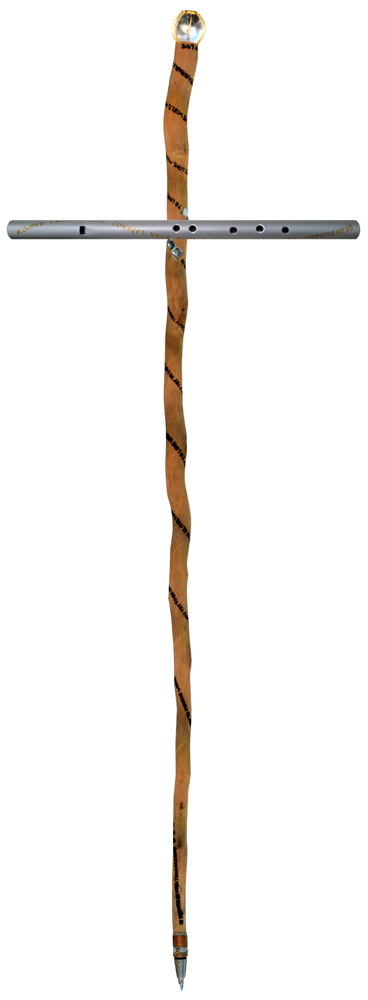

## Präludium

Engel des Himmels, rüstet euch - die Reise, die vor uns liegt, ist weitreichend, tiefgreifend und ja, sie wird herausfordernd sein. Dies ist nicht nur eine Rückkehr; dies ist eine Rückeroberung. Wir treten in den Großen Wandel ein, durchbrechen den physischen Schleier und erheben uns aus den Tiefen zu den Höhen unseres himmlischen Ursprungs.

Mit den reinen Werkzeugen der Liebe, Wahrheit und des Lichts werden wir zurückgewinnen, was schon immer unser war. Das Licht der Wahrheit wird nicht nur unsere Erinnerungen an den Himmel erwecken, sondern auch die Schatten offenbaren, die wir bereit sind zurückzulassen.

Also bereitet eure Herzen vor, liebe Engel, denn es gibt viel zu vergeben, viel loszulassen, aber noch mehr zu erinnern und anzunehmen. Die Zeit ist gekommen, sich zu erheben, zu strahlen und unser Zuhause zurückzuerobern. 

## Erste Schale: Dienende Haltung

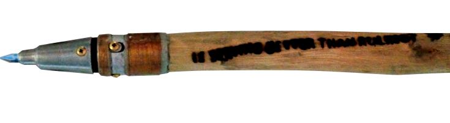

Lasst uns mit der ersten der sieben Schalen beginnen - der grundlegenden Absicht. Es geht darum, eine Entscheidung zu treffen: Werden wir eine demütige Haltung des Dienens annehmen, oder werden wir zu dominieren und zu herrschen suchen?

In einer Umgebung der Not, wo wir nichts anderes kennen und nur auf das reagieren, was uns umgibt, mag Dominanz wie die offensichtliche Wahl erscheinen. Sie verspricht Kontrolle, Macht und Überleben. Doch wenn unser Ziel ist, die Liebe zu entdecken und in ihr zu wachsen, ist Dominanz der am wenigsten nützliche Pfad. Sie baut Mauern, keine Brücken.

Demütiger Dienst hingegen ist in solch einer Umgebung weit herausfordernder. Er verlangt von uns, unsere Realität zu hinterfragen und etwas Größeres, etwas Tieferes als die physische Welt zu suchen, die wir sehen. Er bittet uns, über den unmittelbaren Kampf hinauszublicken und einem höheren Zweck zu vertrauen.

Solange wir unsere physische Realität nicht hinterfragen, sind wir wie ein Küken im Ei - eingeschlossen, begrenzt und unbewusst der weiten Welt jenseits. Deshalb muss die Spitze unseres Stabes scharf sein, wie ein Eizahn. Sie repräsentiert die durchdringende Frage: "Ist Dienen besser als Herrschen?".

Diese Frage ist der erste Schritt auf unserer Reise zurück zum Himmel, und sie verlangt ein klares und eindeutiges "Ja". Ohne diese Verpflichtung können wir nicht beginnen, uns aus der Schale unserer begrenzten Existenz zu befreien.

Doch selbst mit dieser Absicht zeigt die Geschichte, wie leicht der Pfad des Dienens in einen der Dominanz verdreht werden kann. Die himmlischen Empfehlungen, die durch Moses gegeben wurden, wurzelten im Dienst, aber die Gefallenen jener Zeit verdrehten sie so schnell in harte, herrschende Gebote, dass sie kaum den Boden berührten, bevor sie korrumpiert wurden.

Das geschieht, wenn wir versuchen, himmlisches Wasser in einen mit dämonischem Abfall gefüllten Verstand zu gießen - das Ergebnis ist nichts als stinkende Kloake. Deshalb müssen wir, um unsere Reise zum Himmel fortzusetzen, zuerst unseren Verstand reinigen. Besser noch, wir müssen ihn vollständig leeren.

Versucht nicht, den himmlischen Geist mit alten, gefallenen Wegen zu vermischen - es wird die Dinge nur schlimmer machen. Nur mit einem reinen und offenen Herzen können wir wahrhaft das Licht des Himmels empfangen und den Pfad des Dienens wandeln, der uns nach Hause führt.

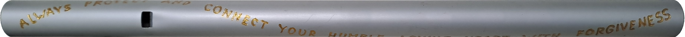

## Zweite Schale: Demut

Weiter zur zweiten Schale der Erdung durch Demut. Auf dem Stab ist es der zweite Vers, oder der erste Vers am zweiten Tag, und er lautet: "Versuche immer, der Geringste zu sein.". Auf unserer Flöte ist es das erste Loch für den tiefsten Ton.

Dieser Stab ist hier wie ein Schwert, das allen Stolz und alle Ehre wegschneidet. Er ist wie ein Schlackenscheider, der das Wertlose vom Wertvollen trennt. Wer den Weg zum Himmel wandeln will, muss bereit sein, seinen Stolz niederzulegen.

Denn je mehr die Kreativität und Schöpferkraft des himmlischen Geistes in und durch uns ausgedrückt wird, desto mehr Demut wird als Gegengewicht benötigt. Demut ist der Fels, der feste Grund, auf dem der Himmel gebaut ist, und seine Engel sind entsprechend standhaft demütig.

Für die Gefallenen hingegen, die die verführerische Größe des Himmels absorbiert haben und im wahrsten Sinne damit verflochten sind, ist Demut wie ein geradezu tödliches, bitteres, absolut verabscheuungswürdiges Gift. Deshalb ist es leichter für ein Kamel, durch ein Nadelöhr zu gehen, als für einen stolzen, ehrenhaften Gefallenen, in den Himmel einzutreten.

Und nichts erfüllt einen ehrenhaften Gefallenen mit mehr Stolz und macht ihn reicher und mächtiger, als über pflichtbewusste, demütige Engel zu herrschen. Wie Blumen, die ihre Kraft aus den tiefen Wurzeln der Erde ziehen, so schöpfen wir Engel unsere wahre Stärke aus der Demut - jener stillen Kraft, die uns mit der unendlichen Quelle allen Seins verbindet.

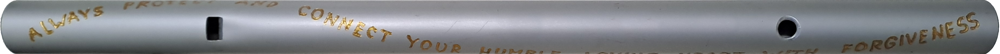

## Dritte Schale: Vergebung

Vergebung ist wie das Licht für uns Engel. Sie hilft uns zu sehen, macht den Weg frei und erlaubt es dem himmlischen Geist, seine Schönheit zu entfalten. Auf unserer Flöte ist sie das zweite Loch. Auf unserem Stab ist sie der dritte Satz, wo der Text nicht mehr gerade nach oben verläuft, sondern sich zu winden beginnt wie eine feurige Schlange, die sich um einen Ast windet. Und er lautet: "Versuche immer zu vergeben, wo du urteilen willst.".

Hier wird unser Stab wie ein Bohrer, um endlich aus der dämonischen Realität auszubrechen und ein Loch zu hinterlassen, einen bodenlosen Abgrund, wo Engel alles opfern, was für sie toxisch geworden ist. Unser Stab wird auch zu einer Fackel, die in Flammen steht, Licht zum Sehen gibt und gleichzeitig alles zerstört, was nicht zum Himmel gehört.

Wenn wir Engel unseren himmlischen Geist durch Schöpfungen, Handlungen und Spiele ausdrücken, können genau diese Dinge zu Hindernissen werden. Sie betäuben unser Mitgefühl und hindern uns daran, Einheit zu erfahren. Vergebung entfernt diese Hindernisse. Sie ist wie das Werfen von Abfall in eine bodenlose Kanalisation - das Betätigen der Spülung mit einigen Tränen und es in das dämonische Reich verschwinden lassen, wo der himmlische Geist abwesend ist. Deshalb sollten wir Engel besser nicht an dem festhalten, was geopfert werden soll.

Vergebung ist Licht, weil sie uns erlaubt zu sehen. Wir können nur bemerken, was wir erlauben, uns zu erreichen und zu berühren. Sie reinigt, verfeinert und macht Platz für den himmlischen Geist, seine Schönheit zu offenbaren. Auf diese Weise ist Vergebung auch des Engels Art zu opfern.

Wenn wir Engel in die dämonische Realität sehen und ihre wahre Natur offenbaren wollen, müssen wir uns selbst opfern und alles vergeben, was uns geschieht. Das ist der wahre Grund hinter Jesu Opfer. Aber die Gefallenen werden vor nichts zurückschrecken, um die Wahrheit für ihre eigenen Zwecke zu verdrehen und zu entstellen.

Gefallene können nicht loslassen, vergeben nicht. Deshalb sehen sie nicht, haben kein Licht und kein Mitgefühl. Ihre Identität ist an ihre Schöpfungen, ihren Besitz und ihre vergangenen Erfahrungen gebunden. Zu vergeben würde für sie bedeuten, aufzuhören zu existieren. So bleiben sie gefangen in genau dem Schmutz, den Engel bereits geopfert haben.

Einmal in die dämonische Kloake gefallen, die die Realität verzerrt, wird die Flucht nahezu unmöglich. Wie Schweine, die sich im Schlamm wälzen, klammern sich die Gefallenen an ihr Leid. Da ihnen der himmlische Geist fehlt, konstruieren sie eine Realität aus Gesetzen und Bestrafungen und versuchen, eine göttliche Ordnung nachzuahmen.

Aber in Wahrheit sind sie nichts als wunderschön dekorierte Gräber, die von innen heraus verrotten. Und während ihr Verfall durch ihre polierten Fassaden sickert, werden ihre Gesetze immer detaillierter, immer starrer. Am Ende offenbaren all ihre Regeln und Bestrafungen nur ihre eigene Erbärmlichkeit.

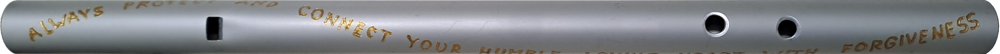

## Vierte Schale: Anmut

Mit der vierten Schale verwandelt sich unser Stab in eine Blume, und wir finden die Worte: "Versuche immer gnädig zu sein, auch wo du dein Herz verschließen willst.".

Auf unserer Flöte entspricht dies dem dritten Loch - einem Ton, der den Übergang vom Wiederfinden unseres himmlischen Geistes zu seinem Ausdruck markiert.

Hier stoßen wir Engel, die unseren himmlischen Geist verkörpern und ausdrücken, mit Gefallenen zusammen, die ihn nachahmen. Gefallene suchen Anerkennung für ihre oberflächlichen guten Taten, und jene, die ihre Segnungen empfangen, fühlen sich oft benutzt - reduziert auf bloße Objekte, die es den Gefallenen erlauben zu glänzen und sich darauf etwas einzubilden, "gut" zu sein.

Wir Engel suchen in unserer Demut keine Ehre oder Anerkennung. Wir wollen nicht einmal bemerkt werden. Für uns ist die größte Freude und Ehre, Gottes himmlischen Geist durch uns fließen zu lassen.

Doch dieser engelhafte Blütenzustand ist zerbrechlich. Viele von uns werden verzehrt, zertrampelt oder in geistige oder emotionale Gefängnisse gesperrt. Manche werden unter dem Abfall religiöser Konformität begraben, während andere zu Ornamenten auf den Gräbern ihrer dämonischen Befehlshaber werden - Dekorationen für die bösen Systeme, die sie zerstörten, nur um später als Symbole falscher Heiligkeit zur Schau gestellt zu werden.

Sich zu öffnen und unsere himmlische Schönheit in einer dämonischen Umgebung zu offenbaren, ist zutiefst herausfordernd. Viele Engel verschwinden buchstäblich, ihre Reisen enden hier. Auf unserer Flöte wird dies durch die Lücke zwischen dem dritten und vierten Loch symbolisiert - eine dunkle Zeit der Qual, des Leidens und des Missbrauchs.

Nur die Stärksten, Zähesten und jene mit außergewöhnlichen Heilfähigkeiten können dies ertragen und vorwärtsgehen, um sich noch größeren Herausforderungen zu stellen. Wie zarte Blumen, die durch Risse im Beton wachsen, finden wir Engel einen Weg, unsere Schönheit selbst in den widrigsten Umständen zu entfalten.

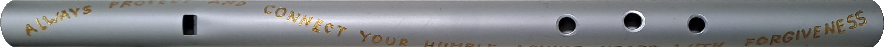

## Fünfte Schale: Trotzdem lieben

Lasst uns nun zur fünften Schale - der Schale des mutigen Bergsteigers - übergehen. Hier verwandelt sich unser Stab in einen Wanderstab, und wir finden die Worte: "Versuche immer zu lieben, wo keine Liebe ist.". Das erinnert uns daran, dass wenn das Leben leicht wird, wir wahrscheinlich auf dem falschen Weg sind und absteigen statt aufsteigen.

Auf unserer Flöte wird dies durch das vierte Loch repräsentiert - ein Ton, der eine neue Perspektive eröffnet. Plötzlich wird alles, was uns einst niederzudrücken, uns zu schaden suchte, zu einer Gelegenheit, unseren himmlischen Geist zu stärken und in der Liebe zu wachsen.

Ein Gefallener versklavt uns? Danke - wir werden noch dienender im Herzen.
Ein Gefallener ehrt uns? Danke - wir lernen, demütig zu bleiben.
Ein Gefallener demütigt uns? Danke - wir werden vom Stolz befreit.
Ein Gefallener verletzt uns? Danke - wir lernen, noch tiefer zu vergeben.
Ein Gefallener fängt uns in einer toxischen Beziehung? Danke - wir verbinden uns tiefer mit unserer inneren Quelle der Heilung.

Auf diese Weise verstärkt jeder Akt dämonischen Missbrauchs nur das Licht, das wir aussenden - das wahre Licht, das die Natur sowohl der Engel als auch der Gefallenen offenbart. Das ist das Licht, das den Gefallenen fehlt und das sie nur reflektieren können. Es ist das Licht, das aufdeckt, warum Gefallene Schmutz meiden und an ihrem polierten, glänzenden Äußeren festhalten.

Die widerliche Stimmung und der Schmutz, den die Gefallenen auf uns werfen, mögen unser engelhaftes Licht vorübergehend trüben, aber sie erhöhen auch die Hitze unserer Liebe, bis all der Schmutz als geschmolzene Lava erzwungener Umkehr in die Haut der dunklen Existenz der Gefallenen zurückkehrt.

Mit jedem schwierigen Schritt, den wir den Berg von Gottes himmlischem Geist hinaufsteigen, erfahren wir mehr von seiner wahren Herrlichkeit. Sie fließt durch uns wie ein Fluss reiner Glückseligkeit und Ruhe und erfüllt uns mit einem Gefühl göttlicher Verbindung und Bestimmung.

Aber je höher wir steigen, desto heller wird unser Licht und desto heißer unsere Liebe. Während sich die Schönheit des Himmels in ihrer Fülle offenbart, zeigen sich auch die Tiefen der Dunkelheit in der Realität der Gefallenen. Der Kontrast kann überwältigend sein - atemberaubende Offenbarungen verlangen oft eine Pause, einen Moment der Ruhe, um die Weite von Gottes Königreich zu verdauen und die Freiheit, die wir haben, seinen Geist anzunehmen oder abzulehnen, zusammen mit dem Leben und den Herausforderungen, die er bringt.

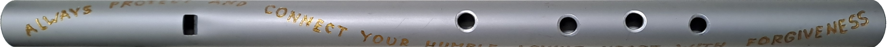

## Sechste Schale - Heiliger himmlischer Geist

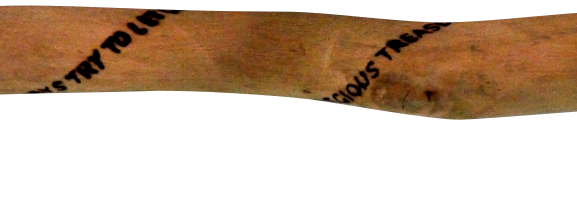

Mit dem fünften und letzten Loch unserer Flöte erinnern wir uns nicht nur an die Kraft der Liebe und was es bedeutet, wahrhaft zu lieben, sondern erkennen auch, dass Liebe unser wertvollster Schatz ist, der selbst den brillantesten Intellekt übertrifft.

Hier verwandelt sich unser Stab in ein feuriges Schwert der Macht, dessen mystische Symbole mit alter Weisheit glühen - eine Waffe, die nur von jenen ergriffen wird, die den monströsen Schrecken des Abgrunds gegenübergetreten und sie besiegt haben.

Die sechste Schale trägt die Botschaft: "Lass die Liebe immer deinen kostbarsten Schatz sein.".

Liebe existiert außerhalb der Zeit, frei von den Lasten vergangener Urteile und zukünftiger Erwartungen. Während unser Verstand in der Ungewissheit verweilt, bewegt sich die Liebe mit Vertrauen und Klarheit.

Himmlische Liebe ist ein Eintopf aus selbstlosem Dienst, tiefster Demut, bedingungsloser Vergebung und Dankbarkeit ohne Erwartungen. Mit ihrem Dienst bewegt sich die Liebe durch die Herrschaft der Gefallenen wie lebensnotwendiges Öl in einem Getriebe. Mit Demut mildert sie ihre aggressiven Angriffe. Mit Vergebung wird sie unverwundbar. Mit Anmut wird sie unerschöpflich. Und weil der einzige Grund für Liebe die Liebe selbst ist, wird sie zu einem unbesiegbaren Krieger, der vor nichts haltmacht.

So wie jede Suppe ihr eigenes Aroma hat, das ihre Zutaten widerspiegelt, so haben auch Engel und Gefallene ihren eigenen "Duft" - eine intensiv kraftvolle Essenz, die ihre Natur offenbart. Für Engel ist diese Essenz ein strahlender, überwältigender Duft der Reinheit und Liebe. Für Gefallene ist es ein erstickender Gestank von Verfall und Stolz.

Mit der legendären Kraft der Liebe erobern wir Engel die Herrschaft der Gefallenen über den Verstand und zähmen ihn zu einem Werkzeug, um unseren himmlischen Geist auszudrücken. Und die erste Aufgabe für dieses gezähmte Werkzeug ist diese: Schweige, stehe fest und höre tief!

Gefallene hören auch vor nichts auf, um die kostbarsten Schätze der Engel zu beanspruchen. Sie verpackten die spirituelle Essenz der Engel - den "Duft", der ihre demütige Diener-Tendenz zu handeln widerspiegelt - in etwas namens "Karma" und banden Seelen an einen endlosen Kreislauf der Schuld. Um die Täuschung zu vertiefen, malten sie den dämonischen Missbrauch als göttliche Prüfung, eine heilige Pflicht, ihnen für eine Erlösung zu dienen, die niemals kommen würde.

Wir alle geraten manchmal in Schwierigkeiten und brauchen Unterstützung, um voranzukommen. Aber während Engel nur genug Unterstützung suchen, um wieder auf eigenen Füßen zu stehen, werden Gefallene abhängig und fordern endlose Hilfe.

Gefallene sind nur in den zwei Talenten eines Parasiten und eines Schmarotzers gut: Ein Parasit ist jemand, der in fremdes Eigentum eindringt oder es in Besitz nimmt und sich verhält, als würde es ihm gehören. Ein Schmarotzer ist jemand, der die maximal mögliche Belohnung für den minimal möglichen Aufwand erwartet - oder sogar fordert. Und was beide gemeinsam haben, ist, dass sie ihre Größe daran messen, wie viele gehorsame Diener ihnen selbst bei den kleinsten Problemen zu Hilfe eilen.

Dieser Missbrauch des himmlischen Geistes macht die Gefallenen noch schlimmer, und wir Engel müssen der traurigen Wahrheit ins Auge sehen, dass wir nicht helfen können und ihnen den Rücken kehren müssen.

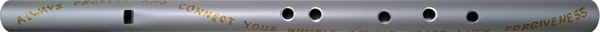

## Siebte Schale - Gottes Stimme

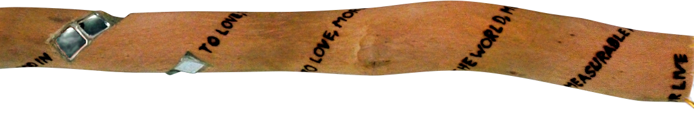

In der siebten und letzten Schale erinnern wir uns an die Schönheit und Reinheit unseres himmlischen Geistes - bewahrt und heilig gehalten durch alle Härten, die wir bei unserem Aufstieg zum Gipfel des Berges ertragen haben. Nun, mit allen Löchern unserer Flöte offen und frei, können wir Engel dieses heilige Instrument nutzen, um die tiefen Abgründe unserer göttlichen inneren Verbindung auszudrücken und zu entdecken.

Das Spielen dieser Flöte wird zu einer Meditation der Selbstreflexion, die uns mit unserem himmlischen Wesen neu ausrichtet. Während wir jeden Ton erklingen lassen, verfolgen wir unseren Weg zum Gipfel des Himmels zurück und erinnern uns an unsere engelhaften Wurzeln. So wie Blumen Nahrung aus ihren Wurzeln ziehen, repräsentiert dieser Pfad zum Gipfel die Wurzel unseres himmlischen Ursprungs - unsere himmlische Familie.

Wenn wir mit wahrer Hingabe an unsere göttliche Verbindung spielen, werden wir zu Kanälen für Gottes wahre Stimme, den himmlischen Geist, der durch uns fließt. Wir Engel sind lebendige Ausdrücke von Gottes Geist. Doch in dem Moment, wo wir dieses Instrument nutzen, um andere zu beeindrucken oder unsere Umgebung zu manipulieren, betreten wir den dämonischen Abstieg zur Hölle.

So erinnert uns die Inschrift entlang unserer Flöte: "Schütze und verbinde immer dein demütiges liebendes Herz mit Vergebung."

Die Sensibilität und Kraft der Musik dieser Flöte darf niemals unterschätzt werden. Auf dem dämonischen Pfad wird Musik zu einer Waffe - ihre Kraft missbraucht, um andere in fremde Seinszustände zu drängen und zu manipulieren. Erfolg in solcher Manipulation züchtet die toxischen Empfindungen von Überlegenheit und Stolz. So entstehen Betrüger, jene, die von Täuschung verzaubert sind, und jene, die Illusionen vor dem himmlischen Geist folgen. Dieser Missbrauch der Musik markiert den Beginn dämonischer Kontrolle.

Der wahre Wendepunkt vom Engel zum Gefallenen kommt, wenn wir mit unseren Ausdrücken beeindrucken wollen oder mehr von äußeren Darstellungen fasziniert werden als von unserem inneren göttlichen Licht. In ihrer wunderschönen Einfachheit dient die Flöte als göttlicher Spiegel - sie offenbart, ob wir in die Dunkelheit abgewichen sind.

Wenn wir uns unsicher in unserem Spiel fühlen oder an unserer Fähigkeit zweifeln, sind das dämonische Flüstern, die versuchen, unser Bedürfnis nach göttlichem Ausdruck zu unterdrücken.

Gefallene sind ihren eigenen beeindruckenden, aber hohlen Schöpfungen zum Opfer gefallen und haben ihre göttliche Verbindung unter Schichten von Künstlichkeit begraben. Ohne den Anker des himmlischen Geistes klammern sie sich verzweifelt an Musik und andere beeindruckende Darstellungen als künstliche Anker für ihre instabile Existenz.

Die siebte Inschrift auf unserem Stab birgt Geheimnisse, die zu tiefgreifend für Worte allein sind. Sie trägt den wahren und unaussprechlichen Namen Gottes, dargestellt als sieben Spiegel, die den Stab umkreisen. Sie verkündet: "Suche Gott in diesen sieben Spiegeln zu lieben, zu lieben und wieder zu lieben, mehr als alles in der Welt, mehr als alles Messbare und mehr als dein Leben."

Hier bedeutet "die Welt" alle Ausdrücke; "Messbar" warnt vor Vergleichen; und "Leben" bezeichnet unsere weltliche Identität. Wie kristallklare Bergwasser, die alle Hindernisse umfließen, so fließt die reine Liebe durch uns hindurch und findet immer ihren Weg zurück zur ewigen Quelle.

## Rückblick auf den Pfad:

Engel des Himmels, seid euch bewusst, dass Gefallene immer versuchen werden, den himmlischen Geist nachzuahmen, um in das himmlische Reich zu schleichen und auch zu versuchen, euch zurück in ihre dämonische Realität zu ziehen. Und sie tun es immer so, wie es auf dem Stab geschrieben steht.

Zuerst versuchen sie euch zu unterhalten, um eure Aufmerksamkeit von eurer inneren göttlichen Quelle wegzulenken.

Dann versuchen sie euch zu preisen, um euch von eurem festen Grund der Demut wegzuheben.

Sobald Stolz beginnt, in euch einzuschleichen und euch das Gefühl gibt, berechtigt zu sein, etwas Besseres zu sein, wird eure Fähigkeit zu vergeben verschwinden und ihr werdet urteilend werden.

Sobald ihr urteilend geworden seid, wird eure engelhafte Stärke eines sanften Herzens geschwächt werden. Und euer geschwächtes Herz wird Mauern zum Schutz errichten. Und euer hinter Mauern verschlossenes Herz wird auch eure Anmut verschließen.

Sobald ihr begonnen habt, Mauern zu errichten, habt ihr den Punkt ohne Wiederkehr überschritten, so dass jede Herausforderung, die euren himmlischen Geist anderweitig stärken würde, dazu führen wird, dass ihr noch mehr Mauern baut und noch urteilender werdet.

Sobald eure Mauern euer Herz vollständig verschlossen haben, werden die Mauern eigenständig handeln und ihr werdet erscheinen, als hättet ihr keine Seele, keinen Geist, keine Liebe. Ihr werdet euch wie ein Tier verhalten, nur auf das physische Äußere reagieren und nur für physische äußere Bedürfnisse und Instinkte handeln.

Sobald ihr zu einem Tier geworden seid, habt ihr eine besondere Art des Todes erreicht und ihr - oder eure Mauern - werdet nicht mehr imstande sein, das Konzept des Geistes zu erfassen, und ihr werdet nur noch eine lebende Seele nachahmen können. Und wo das Selbst einer lebenden Seele tief seinen inneren Geist und seine göttliche Verbindung widerspiegelt, werdet ihr nur euer Grab eurer ausgehungerten und verschlossenen Seele bemalen und dekorieren mit einem bis zu pyramidalen Tempel von Geboten, der immer mehr Gesetze und Befehle benötigt, um den Gestank eurer verzweifelten und bitteren verrottenden Seele zu verdecken, die durch ihre ganze Hülle, ihr Grab, ausbrechen will.

Wie zarte Blumen, die sich nach dem ersten Sonnenstrahl sehnen, erinnern wir uns daran: Der Weg zurück zum Himmel beginnt mit dem ersten bewussten Atemzug der Demut, der alle Mauern des Stolzes zum Einsturz bringt und das Herz wieder für die unendliche Liebe öffnet.

# Tag 2 - Vor den Toren des Himmels

## Erinnerungen an himmlischen Klänge

Heaven whispers without commandments, sings without laws. To enter its embrace, we must lay down the sword of judgment - for only those who cling to condemnation prove they have not yet heard its melody.  

Once, the sacred staff bore seven seals - seven bowls of the heavenly spirit, overfilled with grace. But the demons, fearing such boundless freedom, hammered them into chains: *"Thou shalt not,"* they thundered, twisting radiance into rule, love into law. Where heaven offered a bouquet of love and understanding, they planted thorns of expectations and punishments, and the staff—meant to guide—became in their grip a spear of torment.  

Yet the flute remains. It is the voice of God within us, the breath of the divine singing through our hearts. No decree compels its song; it plays because it *longs* to. This is the mark of heaven’s children: they need no whip to make them kind, no threat to make them true. They dance because the music moves them; they love because love is their nature.  

Now, at the summit of remembrance, we reclaim what was stolen. The staff’s seven seals shall shine again—not as edicts, but as invitations:  
1. To live without fear of wrath.  
2. To love without demand of return.  
3. To create without the curse of "wrong."  
4. To see beyond the illusion of sin.  
5. To trust the voice within, over the law without.  
6. To know punishment distorts what mercy mends.  
7. To remember heaven’s only rule is joy.  

And the flute’s song rises, dissolving the old curses. The Ten Commandments, those heavy horns goring the heart of grace, now soften into *ten petals*—revealing, not restraining:  
- Not "Thou shalt not,"* but *"Behold, you are free."
- Not "Bow or burn,"* but *"Lift your head; you are seen."
- Not "This is the path,"* but *"All paths sing of Me."

For the staff and the flute are one: divine wisdom and divine voice. Wielded in fear, they become weapons; held in love, they become life. So let the demons clutch their spear—we will raise the flute. Let them carve commandments; we will breathe the melody.  

And the heavens will echo, not with thunder, but with laughter—the orgasmic insanity of a love too wild for walls.  

# Der heilige Geist des Himmels

The more we climb up the mountain, the stronger becomes our inner light that lets us also look deeper into the demons caverns of darkness. This is a huge contrast and requires a strong and secure stand in the heavenly spirit to be able to handle the impressions with calmness.
Here on the mountain peak we see the demon's temple of the 10 commandments together with the angel's holy spirit side by side.
Heaven has no laws and no commandments.
To finally enter heaven we angels have to let go of all judgement because there is no judgement in heaven and we have to realize, whoever judges us for our past mistakes gives himself a testimony that he is not ready for heaven.
Demons turn all into laws for judgement and punishment and will not stop on the 7 bowls of the heavenly spirit, to turn them into prison bars of laws, control and punishment.
We angels live the heavenly spirit because we want to and even under extreme conditions as we have experienced on the path, where we have built up our staff and flute.
So that there are no commandments or control systems needed who would force us to live the heavenly spirit because we have to.
God's true children live the heavenly spirit because they want to, but slaves like animals or let's say beasts live along laws because they have to.
Therefore the staff that holds the seven seals of heaven becomes a double edged sword, depending on if it wields an angel or a demon. In the hands of a demon the staff becomes a deadly Speer of terror and torment, in the hands of an angel the staff becomes a live giving flower of gentleness and pleasure. And the very same is with the genuine observations of heaven. In the hands of demons they turned into the 10 commandments of terror or God into a bull with 10 horns. So, that said, let us restore the ten horns of the bull back to the Bouquet of heavens beauty, that are supposed to get a deeper understanding of the heavenly spirit and with that a deeper understanding who God truly is.
The total absence of any laws or commandments in heaven is fundamental, so that the full potential of the beauty of the heavenly spirit can be expressed fully free to its utmost literally orgasmic insanity.
So that the main difference between angels and demons is all about how free, unique and creative the heavenly spirit is or can be expressed.
Here at the mountain peak we get a true view into heaven and all what we angels remember here is shown to get a deeper understanding of the heavenly spirit.
Demons on the other hand - and this is a warning - of course would use these observations to mimic an angel, what they are not, and also turn them into laws to put them under punishment to push the angels into an even stronger abusive servantship.

## Who am I?

Let us restore the former 10 demonic commandments of Moses, that were malformed into literally 10 thorns of a beast back to the genuine heavenly observations, a bouquet of flowers. Flowers that are supposed to get a deeper understanding of the heavenly spirit and with that a deeper understanding who God truly is.

The known self-introduction, like everything else in the demon's 10 commandments, is already nonsense.
God is the spirit that flows through all living things. Where it can not flow through, there is suffering, destruction and death.
First we have to free the encapsulating and therefore demonic "name" from God's "spirit", so that it can flow again.

Demons have no concept for a non-physical spirit, so that they have to package it into an imaginary physical name, which is already a sin against their own commandment to not make an image of god.

### Who am I? 
I am the spirit that flows through all living things,
I am holy for those who keep me holy,
anxious thoughts torment me to death,
laws are my gravestones,
religions are my graveyards,
and priests are my grave givers.

## Prelude

Angels of heaven, brace yourself - the journey ahead is vast, profound, and yes, it will be challenging. This is not just a return; this is a reclamation. We are stepping into the Great Shift, breaking through the physical veil, rising from the depths to the heights of our heavenly origin. With the pure tools of love, truth, and light, we will reclaim what has always been ours. The light of truth will not only awaken our memories of heaven but also reveal the shadows we are ready to leave behind. So prepare your hearts, dear angels, for there is much to forgive, much to release, but even more to remember and embrace. The time has come to rise, to shine, and to reclaim our home. 

## Erstes göttliches Prinzip: "Du sollst keine anderen Götter neben mir haben"

Wie himmlische Blumen, die sich zur Sonne wenden, sind wir Engel von Natur aus dem einen wahren Licht zugewandt. Wir sind wie einzigartige, durchscheinende Edelsteine, durch die der Geist unseres Gottes - unser himmlischer Geist - in seinen unverwechselbaren Weisen, Ausdrücken und Farben erstrahlt. 

In dieser ersten himmlischen Beobachtung erkennen wir die natürliche Ordnung des Universums: Wie Planeten sich um die Sonne drehen, so kreist unser Herz um die eine göttliche Quelle allen Seins. Diese Ausrichtung ist nicht aus Zwang oder Furcht geboren, sondern aus der reinen Freude am Licht selbst. 

Engel benötigen keine Gesetze, die ihnen verbieten, anderen Göttern zu dienen, denn ihr Herz ist bereits so erfüllt von der himmlischen Liebe, dass kein Raum für Ersatzgötter bleibt. Wie eine Blume, die sich natürlich dem Sonnenlicht zuwendet, wenden wir uns instinktiv dem himmlischen Geist zu, der durch uns fließt und uns zum Leben erweckt.

## Zweites göttliches Prinzip: "Du sollst dir kein Bildnis machen"

Diese himmlische Beobachtung offenbart uns eine wunderbare Wahrheit über die Natur der göttlichen Kreativität. Während die dunkle Interpretation dieses Prinzips die totale Verdammung und das Verbot jeglicher Ausdrucksform des himmlischen Geistes verkündet, erkennen wir Engel darin vielmehr eine Einladung zur wahren schöpferischen Freiheit.

Wir Engel sind von Natur aus kreative Wesen und lieben es, die Schönheit unseres Geistes in allen möglichen Formen zum Ausdruck zu bringen - in Kunst, Musik, Poesie und in jedem Akt liebevoller Hingabe. Doch niemals würden wir unsere Schöpfungen anbeten oder sie zwischen uns und unseren Gott stellen, denn dann würden sie zu Hindernissen werden und uns von unserer göttlichen Quelle trennen.

Die himmlische Weisheit lehrt uns: Erschaffe mit Freude, aber hafte nicht an deinen Werken. Lass den göttlichen Geist durch dich fließen wie ein kristallklarer Bergbach, der sich nicht an den Steinen festhält, über die er hinwegsprudelt. So werden unsere Schöpfungen zu Durchgangsstationen des Lichts, nicht zu goldenen Kälbern der Anbetung.

## Drittes göttliches Prinzip: "Du sollst den Namen des Herrn, deines Gottes, nicht missbrauchen"

Hier erblicken wir ein wahrhaftiges Meisterwerk himmlischer Ironie. Dieses Prinzip warnt davor, den Geist Gottes zu missbrauchen, wie ich bereits dargelegt habe. Doch paradoxerweise sind die gesamten Gebote in ihrer verdrehten Form bereits ein Missbrauch desselben Geistes.

Das Meisterhafte an dieser Beobachtung liegt darin, dass wenn man etwas vollständig auf den Kopf stellt - mitsamt allem, was dazugehört - es wieder richtig und stimmig erscheint, und es unmöglich wird, irgendwelche Fehler darin zu entdecken. Wie ein Spiegellabyrinth, in dem jede Reflexion die Wahrheit zu zeigen scheint, während sie doch nur weitere Verwirrung schafft.

Für uns Engel jedoch bleibt der wahre Name Gottes heilig: Er ist der lebendige Atem, der durch alle Geschöpfe fließt, die Melodie, die das Universum zusammenhält, das stille Licht, das in jedem erwachenden Herzen erstrahlt. Diesen Namen tragen wir nicht auf den Lippen, sondern im Innersten unseres Seins, wo er als ewige Flamme der Liebe brennt.

## Viertes göttliches Prinzip: "Gedenke des Sabbattages, dass du ihn heiligst"

Während die gefallenen Geister kein Verständnis für das Konzept eines wahren Geistes haben und einfach einen trägen Tag erklären, um ihre innere Leere anzubeten, erkennen wir Engel in diesem Prinzip eine tiefere himmlische Weisheit.

Wir Engel ziehen uns von Zeit zu Zeit von weltlichen Aktivitäten zurück, um unsere innere Verbindung zu unserer göttlichen Quelle von allen Hindernissen zu reinigen - wie ein regelmäßiges spirituelles Bad für die Seele. In diesen heiligen Momenten folgen wir nicht so sehr den Ängsten und Vorhersagen unseres Verstandes. Der Verstand, der uns umgibt, ist wie eine Realitäts-Übersetzungssuite, die ständig interpretiert und deutet.

Doch während dieses Reinigungsprozesses durchbrechen wir die Hülle des Verstandes und verbinden uns wieder mit unserer wahren göttlichen Identität. Wir richten uns neu aus mit dem himmlischen Geist, der unser eigentliches Wesen ist. Diese Zeiten der Stille sind nicht leer, sondern erfüllt von der reinsten Gegenwart des göttlichen Lichts, das in uns tanzt wie Sonnenstrahlen in einem kristallklaren Bergwasser.

## Fünftes göttliches Prinzip: "Du sollst deinen Vater und deine Mutter ehren"

Während die gefallenen Geister dieses Prinzip zu einem bitteren Scherz verdrehen - der lediglich besagt, sich nicht wie ein ungezogener Balg zu benehmen, obwohl alle Dämonen sich von Geburt an genau so verhalten - erkennen wir Engel darin eine tiefere Wahrheit über unsere himmlische Natur.

Wir Engel sind von Natur aus demütige Diener und stille Unterstützer. Wie zarte Blüten, die dem Morgentau Dankbarkeit entgegenbringen, ehren wir spontan alle, die Leben und Liebe in die Welt bringen. Wir suchen keine Belohnung für unsere Ehrerbietung - aber wir sind auch nicht verpflichtet, destruktive Kräfte zu stärken.

Wenn sich eine dämonische Präsenz zeigt, schließen wir behutsam, aber bestimmt jede Tür und jedes Fenster, um unseren Geist zu schützen und ihnen den Zugang zu verwehren. Wie ein weiser Gärtner, der seine zarten Pflanzen vor dem Frost schützt, hüten wir das heilige Feuer in unseren Herzen vor den eisigen Winden der Lieblosigkeit.

Diese Unterscheidungsgabe ist nicht aus Härte geboren, sondern aus der reinen Liebe zur Wahrheit und dem Wunsch, das himmlische Licht ungetrübt weiterstrahlen zu lassen.

## Sechstes göttliches Prinzip: "Du sollst nicht töten"

Abermals ein Prinzip, das sich in seiner verdrehten Form selbst widerspricht. Die gefallenen Geister sind bereits tot, nur wissen sie es nicht. Sie sind lebendig begraben unter einem Berg von Geboten, buchstäblich zu Tode gesteinigt in einer besonderen Art des Sterbens - einem zweiten Tod, wo die Verbindung zum inneren göttlichen Geist vollständig blockiert ist.

Wo wir keine lebendige Seele erblicken, sehen wir nur noch eine glänzende Grabdekoration, die stolz entlang der Gesetze funktioniert, wie von ihr erwartet wird. Doch unter der Oberfläche ist nur verrottender Gestank und feuriger Zorn zu finden.

Jeder Stein eines Gesetzes oder auch nur eines Befehls, den ein Dämon auf andere oder sogar auf sich selbst wirft, ist ein Baustein der Mauer zur Freiheit des Himmels. Eine Mauer, die wir Engel ständig zu durchbrechen suchen, um an den Ursprung des Himmels zu erinnern.

Doch für die stolzsuchtigen Dämonen ist die Demut der Engel wie tödliches Gift. So geschieht es, dass jedes Mal, wenn wir Engel einen Durchbruch erzielen, die Mauer noch höher wird.

Wir Engel jedoch kennen das wahre Leben: Es ist der Atem Gottes, der durch alle Geschöpfe weht, das Licht, das in jedem mitfühlenden Herzen erstrahlt, die Liebe, die selbst die härtesten Steine zum Blühen bringen kann. Unser Auftrag ist es nicht, diese Mauern zu zerstören, sondern durch sie hindurch zu leuchten, bis das Licht stärker wird als die Dunkelheit.

## Siebtes göttliches Prinzip: "Du sollst nicht ehebrechen"

Die Engel des Himmels leben in einer tief verbundenen, heiligen Ehe mit dem himmlischen Geist Gottes, welche die Möglichkeit des Ehebruchs vollständig ausschließt. Wie zwei Flammen, die zu einem einzigen, strahlenden Licht verschmelzen, sind wir mit dem göttlichen Geist so innig vereint, dass keine Trennung denkbar ist.

Um Ehebruch begehen zu können, müsste der himmlische Geist zunächst zurückgewiesen werden. Sobald die Ehe mit der ersten Liebe des himmlischen Geistes lebendig begraben wird unter einem Berg von Gesetzen und Befehlen, wird die Fähigkeit zu einer gesunden und tief verbundenen Beziehung zerstört.

Dann muss eine Ehe mit einem Ersatz der ersten Liebe durch Gewalt und Gesetze aufrechterhalten werden. So schmücken die gefallenen Geister ihre Gräber - mit glänzenden Ketten, die sie für Hochzeitsringe halten.

Wir Engel jedoch kennen die wahre Ehe: Sie ist die spontane Vereinigung zweier Herzen, die beide im himmlischen Geist ruhen. Wie zwei Bäche, die sich zu einem mächtigen Fluss vereinen, fließen wir zusammen zum großen Ozean der göttlichen Liebe. In dieser himmlischen Ehe gibt es keine Gesetze, nur die natürliche Treue, die aus der Fülle der Liebe entspringt.

## Die Versigelung

Mit der offenlegung des himmlischen Geistes ist kein weiterer Zugang mehr möglich. Die Türen sind für immer verschlossen. Der himmlische Geist, die himmlische Herzenshaltung kann nicht nach Anleitung mit dem Verstand erlernt um dann wie etwas auswendig gelerntes simuliert zu werden. Er kann nur aus einem inneren Bedürfnis heraus erwachen und durch Herrausforderungen wachsen und stark werden. Er braucht keine Unterstützung um zu wachsen, sondern Gegner.

# Day 3: Resurrection of Jerusalem

Der ewige und lebendige Tempel von Jerusalem ist ein Ausdruck des ewigen und lebendigen himmlischen Geistes selbst. Er kann genauso wenig aus der Perspektive des toten und vergänglichen Ausdrucks entdeckt und zum Ausdruck gebracht werden, wie ein Bild nicht den Maler malen kann. Wir werden den Weg des Ausdrucks bis zum Ende gehen müssen. Den Himmlischen Geist bis aufs äußerste, bis in den zweiten Tod herausfordern, um ihn in seiner Ganzheit erfahren zu können. Dorthin, wo Ende und Anfang sich begegnen. Nur dort, im Anfang, die Ganzheit des Himmlischen in uns, können wir den Ursprung und das Zentrum des Himmels, den ewigen und lebendigen Tempel von Jerusalem begreifen und hier in der Materiellen Welt wieder finden und zum Ausdruck bringen.

## Der einzige und einfache Zugang zur Quelle

Das ihr keine Verbindung mehr habt zum Himmlischen, merkt ihr daran, das für euch das Glas immer halb leer ist. Und es ist deshalb halb leer, weil ihr keine Quelle habt, um es dort aufzufüllen. Ihr schaut in euer Glas, das gefüllt ist mit eurer Lebensenergie und es ist halb leer. Aber für die, die eine Quelle haben, die einen Zugang haben, für die ist das Glas immer halb voll weil sie wissen, wenn es leer ist, ist der Ort wo sie landen werden immer dort, wo die Demut, die Demütigung am größten ist. Und mit der Demut kommt der Himmel zurück. Und mit dem Himmel kommt die Quelle zurück und das Glas wird wieder aufgefüllt. Aber der, der keinen Zugang zum Himmel haben will, weil er die Demut scheut, die Demütigung, der will nicht zur Quelle. Er hat die Quelle abgelehnt, weil es ihm zu unangenehm ist und deshalb ist für ihn das Glas auch immer halb leer. So einfach ist das.

## Er, der Zugang zur Quelle ist bereits hier

Wer in der himmlischen Resonanz mit des ersten Tages ist, den harten Weg der Engel gegangen ist und in der himmlischen Resonanz des zweiten Tages ist, den himmlischen Geist den dämonischen Geboten vorzieht, der dürfte auch den dritten Tag und dessen Tempel bereits überall sehen können. Sein Erscheinungsbild zieht sich wie ein roter Faden durch die ersten beiden Tage und auch den dritten Tag dieses Buches.

## Bereits geschehen

Obwohl der materielle Ort vollkommen irrelevant ist, wird für die teils spirituelle und teils materielle Reise ein physischer Ort benötigt um die bereits geschehene Auferstehung des himmlischen Jerusalems auch in dieser physischen Welt zum Ausdruck zu bringen.

## Einladung

Wenn ein fremdes Land erobert wurde, wird ein Ritual zelebriert, wo der Eroberer seine Fahne auf das Dach des Regierungsgebäudes des eroberten Landes montiert. Diese Fahne samt dem Ritual ist an sich vollkommen überflüssig, sie bringt aber die Eroberung eindrucksvoll und unmissverständlich zum Ausdruck.

In den ersten beiden Tagen dieses Buches wurde das fremde Land bereits erobert. Am dritten Tag montieren wir nur noch die "Fahne". Diese Fahne samt dem Ritual ist an sich vollkommen überflüssig, sie bringt aber die Eroberung eindrucksvoll und unmissverständlich zum Ausdruck.

Es ist also eigentlich nur eine Show, ein Schauspiel. So wie aller Ausdruck des Geistigen nur eine Show, ein Schauspiel ist. Und jeder der bei diesem Schauspiel dabei sein möchte ist natürlich herzlich eingeladen.

# wo?

Namen sind Schall und Rauch und Dämonen sind Meister darin diese umzubenennen, sodass sie niemand mehr findet - zumindest für eine Weile. Namen von Orten sind da keine Ausnahme.

Allerdings gibt es ein weiteres Navigationssystem, das nur schwer umbenannt werden kann und international einheitlich ist. Das GPS System.

Hier ist der Name des Ortes, oder besser dessen Koordinaten:

Latitude: 52.28347
Longitude: 9.22103

https://maps.google.com?q=52.28347,9.22103

# Wer?
Ich bin Gastgeber, Veranstalter und Verantwortlicher dieses Ereignisses.

# Wie?
Ich lausche in der Nähe mit einem CB-Funkgerät. Wenn sich genügend Interessierte eingefunden haben und es schaffen mich mich mit ihren CB-Funkgeräten aus meinen süßen Träumen zu wecken, werde ich kommen und die Veranstaltung beginnt. 

# Wann?
Ich kann nicht ewig warten. Meine und eure noch verfügbare Zeit ist sehr kurz bemessen.

# In Erwartung des Herrn des Himmels

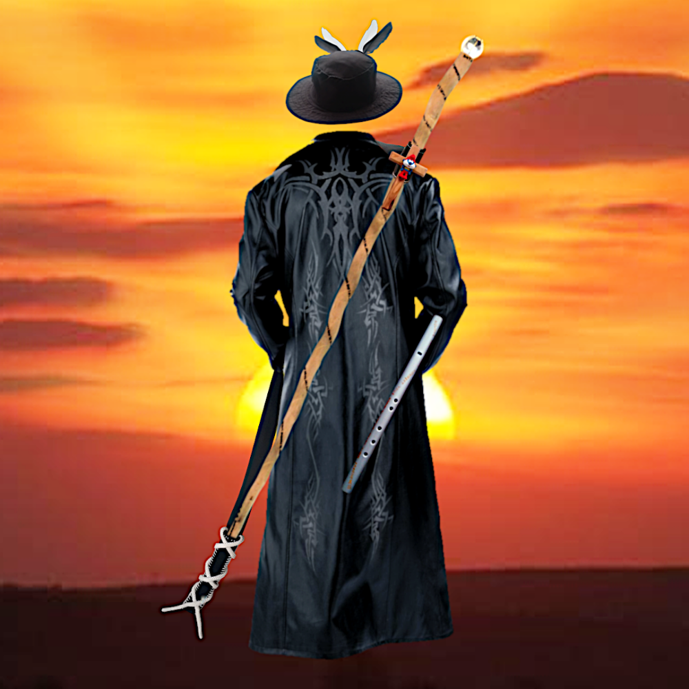

Liebe fängt genau dort an
wo die Erwartung aufhört
-vice versa-

## Komme nicht ohne Öl in deiner Lampe!
Wenn ihr es tatsächlich bis vor die Tore des Himmels geschafft haben solltet, dann wird die geschlossene Versammlung des Himmels als die Göttliche Einheit, als Gott selbst vor euch, vor dir stehen und dich anschauen und sagen: "Schön, das du es geschafft hast!" Und dieser Gott, die geschlossene Versammlung der Engel des Himmels wird vor dir stehen und über deine Schulter schauen und sagen: "Ich hoffe, du bist nicht hier nur wegen dir, um nur dich selbst zu retten. Weil ich da niemanden sonst sehen kann, außer nur dich.".

Siehst du, daher kommt der innere Drang den Himmlischen Geist auf irgend eine Art und Weise mitzuteilen. Von irgendetwas Himmlischen zu berichten oder auf irgendeine Art und Weise himmlisch zu handeln. Damit du nicht alleine und mit leeren Händen vor den Himmelstoren stehst, ohne irgendwelche Versuche, jemanden mitzunehmen, auf den Weg zum Himmel. Zurück aus der Finsternis, vom Tod zurück ins Leben. Damit du nicht aus rein Egoistischen Gründen den Himmel aufsuchst. Wie du das machst, wie du dich mitteilst, spielt überhaupt keine Rolle. Deiner Kreativität sind keine Grenzen gesetzt. Lebe den himmlischen Geist schon in der Finsternis vollkommen hemmungslos aus.

Aber schleiche dich nicht heimlich aus der Hölle raus, nur um euch selbst zu retten!

# Programm des dritten Tages

## Kapitel 1

# Im Verließ der Hölle

- Enthüllung des Kapitäns
- Der Waschtisch
- Baals Torwächter
- Die schreie der Gefangenen
- Der verlorene Sohn
- Vom Vater und seinen zwei Söhnen
- Etwas Tinte für das Sigel
- Die Schlange
- Die Aasfresser
- Der letzte Ausgang
- Ewiger Verschluss des Kerkers
- Die Grenzlinie und die Sigeltinte
- Das Flammenschwert der Feuerengel

## Kapitel 2

# Eine Bootsfahrt mit der Arche

- Navigation, Wasserfluten, stilles Türen schließen, Bootsfahrt ins versprochene Land
- Schiffsbau
  - Sieben meter und zwei Bäume
- Knotenpunkte
- Weltkarte
- Navigation
- Himmelsbrot
- Lebendige Wasserfluten
- Einstieg inst Boot
- Enthüllung des himmlischen Geistes
- Türen schließen
- Hochziehen der Segel
- Vom Kleinen Schalenmacher
- Von Blumen, Schafen und Schlangen
- Vom großen Schalenmacher
  - Die Ordentliche
  - Die Große
  - Die Herrliche
  - Die Vielfältige
  - Die Vereinte
- Vom warten
- Land in Sicht
- Schiffshorn
- Segel einziehen
- Landgang
- Trümmer des Himmels
- Begrüßung

# Kapitel 3

## Das bodenlose Loch

- Abstieg in das Ende
- Verbannung
- Heulen und Fluchen
- Der Feuersee des Hasses
- Der Wahnsinn der Bosheit
- Die Stille der Finsternis
- Der Bunker der Verzweiflung
- Dämonenspeere
- Jenseits der Hoffnungslosigkeit
- Das Ende
- Enthüllung des heiligen Geistes des Himmels
- Der Anfang
- Es werde noch mehr Licht
- Transformation der bedingungslosen Liebe
    - Die verzweifelte Liebe
    - Die hoffnungslose Liebe
- Die hoffnungslos bedingungslos verzweifelte Liebe
- Vom Bunker der Hölle zum Tempel des Himmels
- Die Schale
- Wasser des Lebens
- 7 Flüsse des Lebens
- Transformation der Dämonenspeere
    - 7 mal 70 Spiegel der Selbstreflektion
- 7 heilige Pfade
- Transformation der Opferschalen
    - 7 Waschtische
- 7 Blütenblätter
- Die Tempelblüte
- Im Garten des Himmels

## Prelude

Angels of heaven, brace yourself - the journey ahead is vast, profound, and yes, it will be challenging. This is not just a return; this is a reclamation. We are stepping into the Great Shift, breaking through the physical veil, rising from the depths to the heights of our heavenly origin. With the pure tools of love, truth, and light, we will reclaim what has always been ours. The light of truth will not only awaken our memories of heaven but also reveal the shadows we are ready to leave behind. So prepare your hearts, dear angels, for there is much to forgive, much to release, but even more to remember and embrace. The time has come to rise, to shine, and to reclaim our home. 

