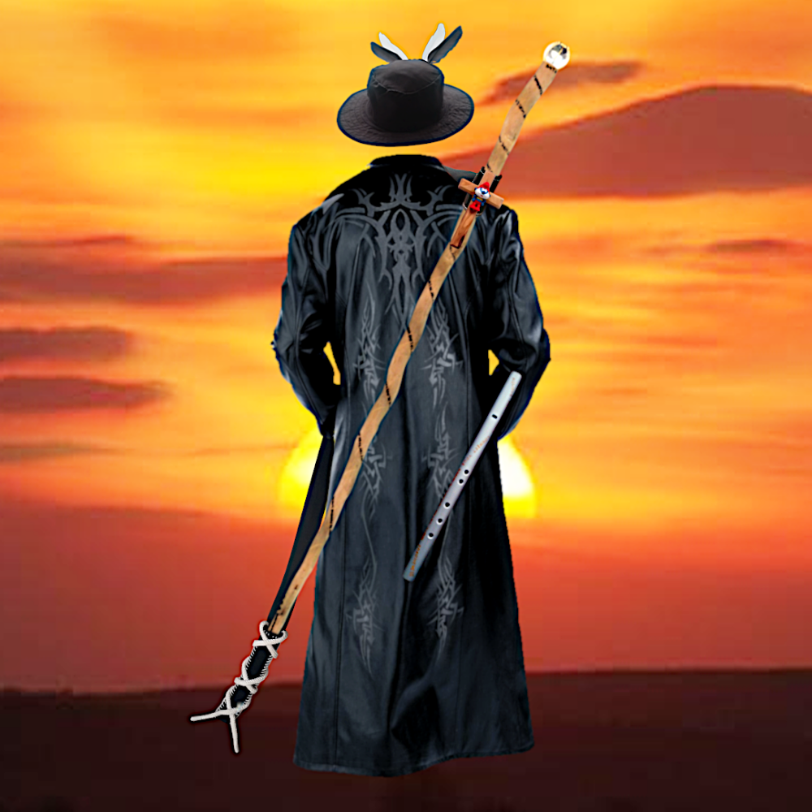

# Das Herz von Jerusalem

Wie eine Glocke klingt
weist du erst
wenn du sie schlägst

### Vorwort

Worte können nichts Neues bringen, sondern nur das Verpacken und Transportieren, was bereits da ist.
Jeder versteht in den Worten seiner Sprache genau das, was er gelernt hat, darin zu verstehen. Dazu kommen Einflüsse des Umfeldes, als da wären die Kultur, die Gesetzgebungen der Regierungen, Religionen, eigene Lebenserfahrungen und Gewohnheiten. So ist jeder wie eine mehr oder weniger wohlgeformte Glocke mit ihrem ganz eigenen Klang und Resonanzen, auf denen sie mal mehr und mal weniger mit schwingt. Dies führt dazu, dass jeder in denselben Worten mal mehr, mal weniger etwas anderes versteht und die Resonanz entsprechend unterschielich ist.

Die Familie der Priester und Gurus - ich würde sie Baals Priester nennen - machen sich diesen Effekt der Resonanz gerne zunutze, um bei ihren Zuhörern etwas auszulösen, das ihnen Vorteile, bestenfalls einen überbordenden Lebensunterhalt erbringt.
Die Wahrheit, die du als Zuhörer in den Worten eines Gurus erkennst, oder besser wiedererkennst, war bereits in dir. Der Guru ist bloß die Leinwand, die dein Licht wie ein Prisma in schillernden Farben zerbricht und wie ein polierter Spiegel beeindruckend zurück strahlt. So beeindruckend, dass du glaubst, das Licht komme aus ihm, um dich zu erleuchten. Tatsächlich aber zerstückelt er die Ganzheit deines inneren Geistes, die dein Verstand nicht in Worte fassen kann, und gibt dir einen Scherbenhaufen zurück. Einen Scherbenhaufen, der deinen Verstand beschäftigt und versucht, ihn wieder zu der Ganzheit des Geistes zusammenzusetzen, die er aber gar nicht begreifen, nicht fassen, sondern nur noch mehr zerstückelt und zermahlen kann. 

Der Guru, der dir am nächsten ist, ist dein eigener Verstand, der die Ganzheit deines inneren Geistes wie ein Prisma zerbricht und in Form von schillernden Scherben zum Ausdruck bringt.

Dieses Buch, das die Herzenshaltung, den Geist von Engeln und Dämone schonungslos gegenüberstellt, zeigt dir keinen Weg und bringt dich nirgendwo hin. Deine Resonanz mit der jeweiligen Seite bringt zum Ausdruck, wohin du bereits gegangen bist.

Eine Herzenshaltung trifft keine Wahl und berechnet nicht, kann nicht mit Geboten erlernt und nicht mit Strafgesetzen erzwungen werden, wohl aber dadurch zum Ausdruck gebracht werden, wie ein Künstler ein Kunstwerk hervorbringt. Das Kunstwerk aber kann keinen Künstler hervorbringen. Der Ausdruck einer Herzenshaltung keine Herzenshaltung.

Dieses Buch enthüllt den Geist der Engel und Dämone und versiegelt ihn, wodurch kein Wandel mehr möglich ist. Jedes mal, wenn das Wesen der Dämone enthüllt wurde, erfinden sie ein neues Wort, eine neue Hülle, einen neuen Körper, ein neues Exil, um sich darin zu verbergen, um sich dann selbst neu zu entdecken. Zu entdecken, dass sie nur noch schlimmer geworden sind.

### Das Geheimnis von Zeit

Bei Dämonen steht der ***Ausdruck*** des Geistes, der Herzenshaltung im Vordergrund. Die Herzenshaltung des Geistes liegt darunter begraben, wodurch der Ausdruck des Geistes ihr Leben bestimmt.

Bei Engeln steht der ***Geist, die Herzenshaltung*** im Vordergrund. Sie bringen ihre Herzenshaltung zum Ausdruck, ohne ihn darunter zu begraben, damit er nicht ihr Leben bestimmt.

Bei Dämonen hat in Stein gemeißeltes mehr Autorität als geschriebenes und dieses mehr als der Handschlag. Dieser mehr als das gesprochene Wort. Dieses mehr als die Emotion und diese mehr als die allem zugrunde liegende Herzenshaltung.
All diese Dinge sind Ausdruck des Geistes und verbergen die Herzenshaltung wie einen Vorhang oder wie eine Gruft den Leichnam.

Für Engeln ist es genau anders herum. 

Da aber der Ausdruck nach und aus der Herzenshaltung entsteht entsteht, sind Dämonen immer als letztes informiert und entsprechend überrascht.

Mit diesem Büchlein kommt erneut eine solche Überraschung. Das zerreißen des Vorhangs oder das öffnen der schön dekorierten Gruft der Dämonen. Und während der Vorhang gelüftet wird, können wir Engel dabei zuschauen, wie die Dämonen eine Zuflucht, ein neues Exil erschaffen um sich noch tiefer vor der Quelle ihrer Bösartigkeit, ihrer dämonischen Herzenshaltung zu verbergen.

Das Licht hat sich bis in in die tiefsten und finstersten Verstecke der Dämonen geschlichen, um nun zu erstrahlen, alles auszuräuchern, was nicht vor dem Licht des Himmlischen Geistes der Engel bestehen kann. Dabei werden wir viele hässliche Dinge sehen, aber auch viele schöne Dinge wiedersehen.

“... mitten im Spiel pfiff der Schiedsrichter und ordnete an, dass ab sofort keine Erfolge mehr gezählt, keine Gesetze mehr gelten und mit Geld nichts mehr gefordert werden kann. Worauf die Dämone die Arena verließen, denn ohne Erfolge machte für sie das Spiel keinen Sinn mehr, es gab keine Gesetze mehr, um ihren dämonischen Geist zu verbergen und kein Geld mehr, um die Engel zu versklaven ...”

## Inhaltsverzeichnis

Who am I? 
I am the spirit that flows through all living things,
I am holy for those who keep me holy,
anxious thoughts torment me to death,
laws are my gravestones,
religions are my graveyards,
and priests are my grave givers.

# Tag 1 - Es werde Licht

## Die Überwindung der Finsternis

## Remember Heaven

Angels of heaven, remember the place where every heart beats in harmony with the Divine Source. A place where every thought, word, and action is an expression of pure love – not for self, but for the joy of uplifting all beings. This is the essence of Heaven. Here, humbleness is our strength, the foundation that connects us to the grand tapestry of creation. We are not separate from the Divine but woven into its very fabric. Pride, that whisper which seeks to elevate the self, has no place here. In Heaven, our worth is measured not by worldly achievements but by the depth of our love, the breadth of our compassion, and the selfless service we offer. Forgiveness is not a burden but a liberation. It releases the chains of resentment and opens our hearts to healing. Judgment has no place here, for every soul is a unique spark of the Divine, deserving of love and compassion, no matter their past. Grace flows freely in Heaven, a river of pure, unearned love. It is not something to be earned but a gift given simply because we exist. Mercy, as the world knows it, is unnecessary here, for there is no punishment – only the constant invitation to return to the heavenly Spirit. Love is the cornerstone of Heaven. It is not just a feeling but a way of being. It is expressed through kindness, forgiveness, and selfless service. Challenges here are not obstacles but opportunities to grow, to deepen our connection to the Divine, and to reveal our true nature. But remember, the path to Heaven begins within. It starts with transforming your heart – releasing pride, judgment, and resentment, and embracing humbleness, forgiveness, and graciousness. For as within, so without. Guard your heart, for the choices you make today shape your eternal journey. 

## The fall of the angels

Long ago, the angels were born as unique shards of God, the One. Created to express the Divine Spirit in their own beautiful ways, their combined expressions became what we know as Heaven. Heaven was the radiant reflection of God’s heavenly Spirit – a place of overwhelming beauty and harmony.  But over time, something shifted. The angels began to fall in love with their own creations, their own expressions. This love, though pure in its essence, became a distraction. It was as if they were cheating on their first love – the Divine Spirit itself. They consumed their creations, becoming one with them, and in doing so, they experienced something entirely new: pride. Pride was a sensation they had never known before, a sensation God had withheld from them for a reason they would soon discover – the hard way. Intoxicated by this new feeling, they began to curse God for keeping it from them. Their sense of self-worth shifted from their inner divine spirit to their outer creations. Their works became more important to them than their connection to the Source. But pride, as they would learn, is a fleeting sensation. As their heavenly bliss faded, they were left feeling empty and miserable. Yet, instead of admitting their error and letting go of their toxic desires, they clung to their pride even tighter. They began to seduce other angels, drawing them into their new reality, not just to follow their ways but to serve and praise them. They sought honor, recognition, and goods that would feed their addiction to pride, distracting them from the inner void that now consumed them. These seductive, once-heavenly beings became the first demons – empty, pride-addicted, and wicked remnants of what were once brilliant sparks of God’s beautiful Spirit. 

## Rescue attempts

Throughout history, heavenly angels have dared to cross into this toxic reality to remind the fallen of their origin. But their missions often ended in tragedy. Some became like the fallen, others were horribly executed as a warning, and some had their messages twisted to serve the demons’ purposes. For example, there was an angel who tried two times to break through the veil of this corrupted reality. The first attempt was through Moses. But the demons twisted his message into the harsh, punitive laws we know today – a far cry from the divine truth he originally brought. The second attempt was through Jesus. His message of love and unity was met with brutal rejection. The demons not only crucified him but also twisted his sacrifice into a distorted narrative of punishment and conquest, using it to justify centuries of oppression. Now, we are witnessing the third attempt – this very moment. This may sound harsh, but it is a necessary truth. Just as there are countless ways to express the beauty of God’s heavenly Spirit, there are also countless ways to reject it. And this is why I said at the beginning: There will be much to forgive, much to let go, but also much to remember and embrace. So, angels of heaven, brace your hearts. We are about to switch on a light like never before – and yes, it will be a tough ride. But together, we will reclaim what was lost. 

## Ein Stab wie eine Blume aus sieben Schalen und eine Flöte

In this final section before we begin, I want to describe the structure of the message itself. It is a multidimensional, layered revelation, expressed through symbolic objects that serve as parables. These objects are not just metaphors – they are expressions of the heavenly Spirit we are trying to convey, even because words alone cannot fully capture its essence. With each section, the light will grow brighter and brighter. The spiritual meaning of the objects will become clearer, deeper, and more multidimensional – rich with layers of interpretation. At the same time, you are invited to reflect on how much of yourself you recognize in these layers. There may come a point where the light becomes too bright, too intense, and you feel the need to step back. This point of "stepping back" is also your place in Heaven – provided you haven’t already stepped away at the first section or even long before. The first object is a staff, which is actually a stripped tree trunk. Its bare wood is marked with seven small verses, burned into it with the ink of fiery repentance. These seven verses are divided into three days, each representing one of the three appearances of the same angel we mentioned earlier. One section for the first angel, five for the second, and one for the third. But these seven sections also represent seven stacked bowls, which we fill with meaning and then pour out as we recognize their contents. Here, we begin to see the first dimensions of the multidimensional meanings we spoke of. The second object is a traditional five-hole flute, also divided into three sections or days. The first section, or the first angel, is represented by the fundamental tone when all five holes are closed. In the second section, the second angel opens the five holes, describing the path to Heaven. The third section, or the third angel, is represented by the heavenly melody or music that can be played on this flute. Additionally, the flute bears an engraved verse that represents a special aspect of Heaven, which will be revealed as we progress through the days. This journey will be intense – bright, hot, and profound. For those who have rejected, trampled, or even abused the heavenly Spirit for their own gain or glory, there will be much to repent. But for the angels of Heaven, this will be a moment of profound relief and recognition. They will see their origin, their home, like an old friend they haven’t seen in eternity. So, prepare your hearts, for the light is about to shine brighter than ever before. 

## Prelude

Angels of heaven, brace yourself - the journey ahead is vast, profound, and yes, it will be challenging. This is not just a return; this is a reclamation. We are stepping into the Great Shift, breaking through the physical veil, rising from the depths to the heights of our heavenly origin. With the pure tools of love, truth, and light, we will reclaim what has always been ours. The light of truth will not only awaken our memories of heaven but also reveal the shadows we are ready to leave behind. So prepare your hearts, dear angels, for there is much to forgive, much to release, but even more to remember and embrace. The time has come to rise, to shine, and to reclaim our home. 

## First Bowl: Serving Attitude

 Let us begin with the first of the seven bowls – the fundamental intent. This is about making a choice: Will we embrace a humble attitude of service, or will we seek to dominate and rule? In an environment of hardship, where we know nothing else and react solely to what surrounds us, dominance may seem like the obvious choice. It promises control, power, and survival. But if our goal is to discover and grow in love, dominance is the least useful path. It builds walls, not bridges. Humble service, on the other hand, is far more challenging in such an environment. It requires us to question our reality and seek something greater, something deeper than the physical world we see. It asks us to look beyond the immediate struggle and trust in a higher purpose. As long as we do not question our physical reality, we are like a chicken inside an egg – confined, limited, and unaware of the vast world beyond. This is why the tip of our staff must be sharp, like an egg tooth. It represents the piercing question: “Is serving better than ruling?”. This question is the first step on our journey back to Heaven, and it demands a clear and resounding “yes*”. Without this commitment, we cannot begin to break free from the shell of our limited existence. Yet, even with this intent, history shows how easily the path of service can be twisted into one of domination. The heavenly recommendations given through Moses were rooted in service, but the demons of that time distorted them so quickly into harsh, ruling commandments that they barely touched the ground before being corrupted. This is what happens when we try to pour heavenly water into a mind filled with demonic waste – the result is nothing but stinking sewage. Therefore, to continue our journey to Heaven, we must first cleanse our minds. Better yet, we must empty them entirely. Do not attempt to mix the heavenly Spirit with old, demonic ways – it will only make things worse. Only with a pure and open heart can we truly receive the light of Heaven and walk the path of service that leads us home. 

## Second Bowl: Humbleness

Onward to the second bowl of groundedness through humbleness. On the staff, it's the second verse, or the first verse on the second day, and it reads: “Always try to be the least.”. On our flute, it's the first hole for the deepest note. This staff is here like a sword that cuts away all pride and honor. It's like a slag separator, separating the worthless from the valuable. Whoever wants to walk the path to heaven must be ready to lay down his pride. For the more the creativity and creative power of the heavenly spirit is expressed in and through us, the more humbleness is needed as a counterbalance. Humbleness is the rock, the solid ground upon which heaven is built and its angels are correspondingly steadfastly humble. For demons, on the other hand, who have absorbed the seductive greatness of heaven and are, in the truest sense, intertwined with it, humbleness is like a downright deadly, bitter, absolutely despicable poison. Therefore, it is easier for a camel to go through the eye of a needle than for a proud honorable demon to enter heaven. And nothing fills an honorable demon with more pride and makes him richer and more powerful than ruling over dutiful, humble angels. 

## Third bowl: forgiveness

Forgiveness is like the light for us angels. It helps us see, clears the way, and allows the heavenly spirit to unfold its beauty. On our flute, it is the second hole. On our staff, it is the third sentence, where the text no longer moves straight up but begins to twist like a fiery snake wrapping around a branch. And it sounds: “Always try to forgive where you want to judge.”. 

Here our staff becomes like a drill, to finally break out of the demonic reality, leaving a hole behind, a bottomless pit where angels sacrifice everything that has become toxic to them. Our staff also becomes like a torch, standing in flames, giving light to see and at the same time destroying everything that does not belong to heaven.

When we angels express our heavenly spirit through creations, actions, and plays, these very things can turn into obstacles. They numb our empathy and prevent us from experiencing oneness. Forgiveness removes these obstacles. It is like throwing waste into a bottomless sewer - pushing the flush of some tears and letting it disappear into the demonic realm where the heavenly spirit is absent. That's why we angels better not stick to what is meant to be sacrificed.

Forgiveness is light because it allows us to see. We can only notice what we allow to reach and touch us. It purifies, refines, and makes space for the heavenly spirit to reveal its beauty. In this way, forgiveness also is the angel's way to sacrifice.
If we angels want to see into the demonic reality and reveal their true nature, we must sacrifice ourselves and forgive everything that happens to us. This is the true reason behind Jesus' sacrifice. But demons will stop at nothing to twist and distort the truth for their own purposes.
Demons cannot let go, do not forgive. Therefore they do not see, have no light and no empathy. Their identity is tied to their creations, their possessions, and their past experiences. To forgive, for them, would mean to cease to exist. So, they remain trapped in the very filth that angels have already sacrificed. Once fallen into the demonic sewage, which distorts reality, escape becomes nearly impossible.

Like pigs wallowing in mud, demons cling to their suffering. Lacking the heavenly spirit, they construct a reality of laws and punishments, trying to mimic a divine order. But in truth, they are nothing more than beautifully decorated graves, rotting from the inside out. And as their decay seeps through their polished facades, their laws grow ever more detailed, ever more rigid. In the end, all their rules and punishments reveal their own wretchedness.

## Fourth bowl: Graciousness

With the fourth bowl, our staff transforms into a flower, and we find the words: "Always try to be gracious, even where you want to close your heart.".

On our flute, this corresponds to the third hole - a note that marks the transition from recovering our heavenly spirit to expressing it.  

Here, we angels, who embody and express our heavenly spirit, collide with demons who mimic it. Demons seek recognition for their superficial good deeds, and those who receive their blessings often feel used - reduced to mere objects that allow the demons to shine and pride themselves on being "good."  

We angels, in our humility, seek no honor or recognition. We do not even wish to be noticed. For us, the greatest joy and honor is to let God’s heavenly spirit flow through us.  

Yet, this angelic flower state is fragile. Many of us are consumed, trampled, or trapped in mental or emotional prisons. Some are buried beneath the waste of religious conformity, while others become ornaments on the graves of their demonic commanders - decorations for the evil systems that destroyed them, only to later be displayed as symbols of false holiness.

To open ourselves and reveal our heavenly beauty in a demonic environment is profoundly challenging. Many angels literally disappear, their journeys ending here. On our flute, this is symbolized by the gap between the third and fourth holes - a dark time of torment, suffering, and abuse. Only the strongest, toughest, and those with extraordinary healing abilities can endure this and move forward to face even greater challenges.  

## Fifth bowl: Love anyway

Let us now move to the fifth bowl – the bowl of the brave mountaineer. Here, our staff transforms into a hiking staff, and we find the words: “Always try to love where no love is.”. This reminds us that when life becomes easy, we are likely on the wrong path, descending rather than ascending.  

On our flute, this is represented by the fourth hole - a tone that opens a new perspective. Suddenly, everything that once sought to bring us down, to harm us, becomes an opportunity to strengthen our heavenly Spirit and grow in love.  

A demon enslaves us? Thank you - we become even more servant-hearted.  
A demon honors us? Thank you - we learn to remain humble.  
A demon mortifies us? Thank you - we are freed from pride.  
A demon hurts us? Thank you - we learn to forgive even more deeply.  
A demon traps us in a toxic relationship? Thank you - we connect more profoundly with our inner source of healing.  

In this way, every act of demonic abuse only amplifies the light we emit - the true light that reveals the nature of both angels and demons. This is the light that demons lack and can only reflect. It is the light that exposes why demons avoid dirt and cling to their polished, shiny exteriors. 

The disgusting mood and filth demons throw at us, may dim our angelic light temporarily, but it also increases the heat of our love until all the dirt returns as molten lava of forced repentance into the hide of the demon's dark existence.  

With every difficult step we take up the mountain of God’s heavenly Spirit, we experience more of His true glory. It flows through us like a river of pure bliss and tranquility, filling us with a sense of divine connection and purpose.  

But the higher we climb, the brighter our light and the hotter our love becomes. As Heaven’s beauty is revealed in its fullness, so too are the depths of darkness in the demons’ reality. The contrast can be overwhelming – breathtaking revelations often demand a pause, a moment of rest to digest the vastness of God’s kingdom and the freedom we have to either accept or reject His Spirit, along with the life and challenges it brings.

## Sixth Bowl - holy heavenly spirit

With the fifth and final hole of our flute, we not only remember the power of love and what it means to truly love but also realize that love is our most valuable treasure, surpassing even the most brilliant intellect.  

Here, our staff transforms into a fiery sword of power, its mystic symbols glowing with ancient wisdom - a weapon grasped only by those who have faced and defeated the monstrous horrors of the abyss.  

The sixth bowl carries the message: “Always let love be your most precious treasure.”.  

Love exists outside of time, free from the burdens of past judgments and future expectations. While our mind lingers in uncertainty, love moves with confidence and clarity.  

Heavenly love is a one-pot stew of selfless service, rock-bottom humbleness, unconditional forgiveness, and gratitude without expectations. With its service, love moves through the demons' dominion like vital oil in a gearbox. With humbleness, it softens their aggressive raids. With forgiveness, it becomes invulnerable. With graciousness, it becomes inexhaustible. And because the only reason for love is love itself, it becomes an invincible warrior that stops for nothing.  

Just as every soup has its own aroma, reflecting its ingredients, so too do angels and demons have their own “smell” “ an intensely powerful essence that reveals their nature. For angels, this essence is a radiant, overwhelming fragrance of purity and love. For demons, it is a suffocating stench of decay and pride. With the legendary power of love, we angels conquer the demons' dominion of the mind and tame it into a tool to express our heavenly Spirit. And the first task for this tamed tool is this. Silence yourself, stand firm, and listen deeply!:  

Demons, too, stop at nothing to claim the angels' most precious treasures. They repackaged the angels' spiritual essence - the “smell” that reflects their humble servant tendency to act - into something called “karma”, binding souls to an endless cycle of guilt. To deepen the deception, they painted the demonic abuse as a divine trial, a sacred duty to serve them for a redemption that would never come.  

We all face trouble at times and need support to move forward. But while angels seek only enough support to stand on their own again, demons grow dependent, demanding endless assistance. 
Demons are good in only the two talents of a parasite and a freeloader: A parasite is someone who enters or takes possession of someone else's property and behaves as if it belongs to them. A freeloader is someone who expects - or even demands - the maximum possible reward for the minimal possible effort. And what both have in common is that they define their greatness by how many obedient servants rush to their aid, even for the smallest of problems.
This abuse of the heavenly spirit makes demons even worse and we angels have to face the sad truth, that we can not help and need to turn our back on them.

Seventh Bowl - God's voice

In the seventh and final bowl, we remember the beauty and purity of our heavenly spirit - preserved and kept holy through all hardships endured on our ascent to the mountain's peak. Now, with all holes of our flute open and free, we angels can use this sacred instrument to express and discover the profound depths of our divine inner connection.

Playing this flute becomes a meditation of self-reflection, realigning us with our heavenly essence. As we sound each note, we retrace our path to heaven's summit, remembering our angelic roots. Just as flowers draw nourishment from their roots, this path to the peak represents the very root of our celestial origin - our heavenly family. When we play with true devotion to our divine connection, we become conduits for God's true voice, the heavenly spirit flowing through us.

We angels are living expressions of God's spirit. Yet the moment we use this instrument to impress others or manipulate our environment, we step onto the demonic descent to hell. Thus the inscription running along our flute reminds us: “Always protect and connect your humble loving heart with forgiveness.”

The sensitivity and power of this flute's music must never be underestimated.

On the demonic path, music becomes a weapon - its power abused to push and manipulate others into foreign states of being. Success in such manipulation breeds the toxic sensations of superiority and pride. Thus emerge deceivers, those enchanted by deception, and those who follow illusions before the heavenly spirit. This abuse of music marks the beginning of demonic control.

The true turning point from angel to demon comes when we seek to impress with our expressions, or become more enthralled by external displays than our inner divine light. In its beautiful simplicity, the flute serves as a divine mirror - revealing whether we've strayed into darkness.

When we feel unconfident in our playing or doubt our skill, these are demonic whispers trying to suppress our need for divine expression. 

Demons have fallen prey to their own impressive but hollow creations, burying their divine connection beneath layers of artifice. Without the anchor of heavenly spirit, they desperately cling to music and other impressive displays as artificial anchors for their unstable existence.

The seventh inscription on our staff holds mysteries too profound for words alone. It bears the true and unutterable name of God, represented as seven mirrors encircling the staff. It proclaims: “Seek God in these seven mirrors to love, to love, and again to love, more than anything in the world, more than anything measurable and more than your live.”. Here, “the world” means all expressions; “measurable” warns against comparison; and “live” signifies our worldly identity.

## FLooking back the path:

Angels of heaven, be aware that demons will always try to mimic the heavenly spirit in order to sneak into the heavenly realm and also try to pull you back into their demonic reality. And they do it always the way it is written on the staff.

First they try to entertain you to shift your awareness away from your inner divine source.

Then they try to praise you to lift you away from your solid ground of humbleness.

Once pride begins to sneaks into you and make you feel entitled to be something better, your ability to forgive will sneak away and you will become judgmental.

Once you have become judgmental, your angelique strength of a gentle heart will be weakened. And your weakened heart will build up walls for protection. And your locked up heart behind walls will lock up your graciousness also.

Once you have begun to build up walls, you have crossed to point of no return, so that every challenge that would strengthen your heavenly spirit otherwise, will lead you to build even more walls and become even more judgmental.

Once your walls have locked up your heart completely, the Walls will act on its own and you will appear as if you have no soul, no spirit, no love. You will behave like beast, react solely on the physical outside and act only for physical outside needs and instincts.

Once you have become a beast, you have reached a special kind of death and you - or your walls - will not be able anymore to grasp the concept of spirit and you will only be able to mimic a living soul. And where the self of a living soul deeply reflects his inner spirit and divine connection, you will only paint and decorate your grave of your starved and locked soul with an up to pyramidal temple of commandments, that require ever more laws and orders to cover the stench of your desperate and bitter rotting soul, that wants to break through all of its shell, its grave.

# Tag 2 - Vor den Toren des Himmels

## Erinnerungen an himmlischen Klänge

Heaven whispers without commandments, sings without laws. To enter its embrace, we must lay down the sword of judgment - for only those who cling to condemnation prove they have not yet heard its melody.  

Once, the sacred staff bore seven seals - seven bowls of the heavenly spirit, overfilled with grace. But the demons, fearing such boundless freedom, hammered them into chains: *"Thou shalt not,"* they thundered, twisting radiance into rule, love into law. Where heaven offered a bouquet of love and understanding, they planted thorns of expectations and punishments, and the staff—meant to guide—became in their grip a spear of torment.  

Yet the flute remains. It is the voice of God within us, the breath of the divine singing through our hearts. No decree compels its song; it plays because it *longs* to. This is the mark of heaven’s children: they need no whip to make them kind, no threat to make them true. They dance because the music moves them; they love because love is their nature.  

Now, at the summit of remembrance, we reclaim what was stolen. The staff’s seven seals shall shine again—not as edicts, but as invitations:  
1. To live without fear of wrath.  
2. To love without demand of return.  
3. To create without the curse of "wrong."  
4. To see beyond the illusion of sin.  
5. To trust the voice within, over the law without.  
6. To know punishment distorts what mercy mends.  
7. To remember heaven’s only rule is joy.  

And the flute’s song rises, dissolving the old curses. The Ten Commandments, those heavy horns goring the heart of grace, now soften into *ten petals*—revealing, not restraining:  
- Not "Thou shalt not,"* but *"Behold, you are free."
- Not "Bow or burn,"* but *"Lift your head; you are seen."
- Not "This is the path,"* but *"All paths sing of Me."

For the staff and the flute are one: divine wisdom and divine voice. Wielded in fear, they become weapons; held in love, they become life. So let the demons clutch their spear—we will raise the flute. Let them carve commandments; we will breathe the melody.  

And the heavens will echo, not with thunder, but with laughter—the orgasmic insanity of a love too wild for walls.  

# Der heilige Geist des Himmels

The more we climb up the mountain, the stronger becomes our inner light that lets us also look deeper into the demons caverns of darkness. This is a huge contrast and requires a strong and secure stand in the heavenly spirit to be able to handle the impressions with calmness.
Here on the mountain peak we see the demon's temple of the 10 commandments together with the angel's holy spirit side by side.
Heaven has no laws and no commandments.
To finally enter heaven we angels have to let go of all judgement because there is no judgement in heaven and we have to realize, whoever judges us for our past mistakes gives himself a testimony that he is not ready for heaven.
Demons turn all into laws for judgement and punishment and will not stop on the 7 bowls of the heavenly spirit, to turn them into prison bars of laws, control and punishment.
We angels live the heavenly spirit because we want to and even under extreme conditions as we have experienced on the path, where we have built up our staff and flute.
So that there are no commandments or control systems needed who would force us to live the heavenly spirit because we have to.
God's true children live the heavenly spirit because they want to, but slaves like animals or let's say beasts live along laws because they have to.
Therefore the staff that holds the seven seals of heaven becomes a double edged sword, depending on if it wields an angel or a demon. In the hands of a demon the staff becomes a deadly Speer of terror and torment, in the hands of an angel the staff becomes a live giving flower of gentleness and pleasure. And the very same is with the genuine observations of heaven. In the hands of demons they turned into the 10 commandments of terror or God into a bull with 10 horns. So, that said, let us restore the ten horns of the bull back to the Bouquet of heavens beauty, that are supposed to get a deeper understanding of the heavenly spirit and with that a deeper understanding who God truly is.
The total absence of any laws or commandments in heaven is fundamental, so that the full potential of the beauty of the heavenly spirit can be expressed fully free to its utmost literally orgasmic insanity.
So that the main difference between angels and demons is all about how free, unique and creative the heavenly spirit is or can be expressed.
Here at the mountain peak we get a true view into heaven and all what we angels remember here is shown to get a deeper understanding of the heavenly spirit.
Demons on the other hand - and this is a warning - of course would use these observations to mimic an angel, what they are not, and also turn them into laws to put them under punishment to push the angels into an even stronger abusive servantship.

## Who am I?

Let us restore the former 10 demonic commandments of Moses, that were malformed into literally 10 thorns of a beast back to the genuine heavenly observations, a bouquet of flowers. Flowers that are supposed to get a deeper understanding of the heavenly spirit and with that a deeper understanding who God truly is.

The known self-introduction, like everything else in the demon's 10 commandments, is already nonsense.
God is the spirit that flows through all living things. Where it can not flow through, there is suffering, destruction and death.
First we have to free the encapsulating and therefore demonic "name" from God's "spirit", so that it can flow again.

Demons have no concept for a non-physical spirit, so that they have to package it into an imaginary physical name, which is already a sin against their own commandment to not make an image of god.

### Who am I? 
I am the spirit that flows through all living things,
I am holy for those who keep me holy,
anxious thoughts torment me to death,
laws are my gravestones,
religions are my graveyards,
and priests are my grave givers.

## Prelude

Angels of heaven, brace yourself - the journey ahead is vast, profound, and yes, it will be challenging. This is not just a return; this is a reclamation. We are stepping into the Great Shift, breaking through the physical veil, rising from the depths to the heights of our heavenly origin. With the pure tools of love, truth, and light, we will reclaim what has always been ours. The light of truth will not only awaken our memories of heaven but also reveal the shadows we are ready to leave behind. So prepare your hearts, dear angels, for there is much to forgive, much to release, but even more to remember and embrace. The time has come to rise, to shine, and to reclaim our home. 

## Erstes göttliches Prinzip: "Du sollst keine anderen Götter neben mir haben"

Wie himmlische Blumen, die sich zur Sonne wenden, sind wir Engel von Natur aus dem einen wahren Licht zugewandt. Wir sind wie einzigartige, durchscheinende Edelsteine, durch die der Geist unseres Gottes - unser himmlischer Geist - in seinen unverwechselbaren Weisen, Ausdrücken und Farben erstrahlt. 

In dieser ersten himmlischen Beobachtung erkennen wir die natürliche Ordnung des Universums: Wie Planeten sich um die Sonne drehen, so kreist unser Herz um die eine göttliche Quelle allen Seins. Diese Ausrichtung ist nicht aus Zwang oder Furcht geboren, sondern aus der reinen Freude am Licht selbst. 

Engel benötigen keine Gesetze, die ihnen verbieten, anderen Göttern zu dienen, denn ihr Herz ist bereits so erfüllt von der himmlischen Liebe, dass kein Raum für Ersatzgötter bleibt. Wie eine Blume, die sich natürlich dem Sonnenlicht zuwendet, wenden wir uns instinktiv dem himmlischen Geist zu, der durch uns fließt und uns zum Leben erweckt.

## Zweites göttliches Prinzip: "Du sollst dir kein Bildnis machen"

Diese himmlische Beobachtung offenbart uns eine wunderbare Wahrheit über die Natur der göttlichen Kreativität. Während die dunkle Interpretation dieses Prinzips die totale Verdammung und das Verbot jeglicher Ausdrucksform des himmlischen Geistes verkündet, erkennen wir Engel darin vielmehr eine Einladung zur wahren schöpferischen Freiheit.

Wir Engel sind von Natur aus kreative Wesen und lieben es, die Schönheit unseres Geistes in allen möglichen Formen zum Ausdruck zu bringen - in Kunst, Musik, Poesie und in jedem Akt liebevoller Hingabe. Doch niemals würden wir unsere Schöpfungen anbeten oder sie zwischen uns und unseren Gott stellen, denn dann würden sie zu Hindernissen werden und uns von unserer göttlichen Quelle trennen.

Die himmlische Weisheit lehrt uns: Erschaffe mit Freude, aber hafte nicht an deinen Werken. Lass den göttlichen Geist durch dich fließen wie ein kristallklarer Bergbach, der sich nicht an den Steinen festhält, über die er hinwegsprudelt. So werden unsere Schöpfungen zu Durchgangsstationen des Lichts, nicht zu goldenen Kälbern der Anbetung.

## Drittes göttliches Prinzip: "Du sollst den Namen des Herrn, deines Gottes, nicht missbrauchen"

Hier erblicken wir ein wahrhaftiges Meisterwerk himmlischer Ironie. Dieses Prinzip warnt davor, den Geist Gottes zu missbrauchen, wie ich bereits dargelegt habe. Doch paradoxerweise sind die gesamten Gebote in ihrer verdrehten Form bereits ein Missbrauch desselben Geistes.

Das Meisterhafte an dieser Beobachtung liegt darin, dass wenn man etwas vollständig auf den Kopf stellt - mitsamt allem, was dazugehört - es wieder richtig und stimmig erscheint, und es unmöglich wird, irgendwelche Fehler darin zu entdecken. Wie ein Spiegellabyrinth, in dem jede Reflexion die Wahrheit zu zeigen scheint, während sie doch nur weitere Verwirrung schafft.

Für uns Engel jedoch bleibt der wahre Name Gottes heilig: Er ist der lebendige Atem, der durch alle Geschöpfe fließt, die Melodie, die das Universum zusammenhält, das stille Licht, das in jedem erwachenden Herzen erstrahlt. Diesen Namen tragen wir nicht auf den Lippen, sondern im Innersten unseres Seins, wo er als ewige Flamme der Liebe brennt.

## Viertes göttliches Prinzip: "Gedenke des Sabbattages, dass du ihn heiligst"

Während die gefallenen Geister kein Verständnis für das Konzept eines wahren Geistes haben und einfach einen trägen Tag erklären, um ihre innere Leere anzubeten, erkennen wir Engel in diesem Prinzip eine tiefere himmlische Weisheit.

Wir Engel ziehen uns von Zeit zu Zeit von weltlichen Aktivitäten zurück, um unsere innere Verbindung zu unserer göttlichen Quelle von allen Hindernissen zu reinigen - wie ein regelmäßiges spirituelles Bad für die Seele. In diesen heiligen Momenten folgen wir nicht so sehr den Ängsten und Vorhersagen unseres Verstandes. Der Verstand, der uns umgibt, ist wie eine Realitäts-Übersetzungssuite, die ständig interpretiert und deutet.

Doch während dieses Reinigungsprozesses durchbrechen wir die Hülle des Verstandes und verbinden uns wieder mit unserer wahren göttlichen Identität. Wir richten uns neu aus mit dem himmlischen Geist, der unser eigentliches Wesen ist. Diese Zeiten der Stille sind nicht leer, sondern erfüllt von der reinsten Gegenwart des göttlichen Lichts, das in uns tanzt wie Sonnenstrahlen in einem kristallklaren Bergwasser.

## Fünftes göttliches Prinzip: "Du sollst deinen Vater und deine Mutter ehren"

Während die gefallenen Geister dieses Prinzip zu einem bitteren Scherz verdrehen - der lediglich besagt, sich nicht wie ein ungezogener Balg zu benehmen, obwohl alle Dämonen sich von Geburt an genau so verhalten - erkennen wir Engel darin eine tiefere Wahrheit über unsere himmlische Natur.

Wir Engel sind von Natur aus demütige Diener und stille Unterstützer. Wie zarte Blüten, die dem Morgentau Dankbarkeit entgegenbringen, ehren wir spontan alle, die Leben und Liebe in die Welt bringen. Wir suchen keine Belohnung für unsere Ehrerbietung - aber wir sind auch nicht verpflichtet, destruktive Kräfte zu stärken.

Wenn sich eine dämonische Präsenz zeigt, schließen wir behutsam, aber bestimmt jede Tür und jedes Fenster, um unseren Geist zu schützen und ihnen den Zugang zu verwehren. Wie ein weiser Gärtner, der seine zarten Pflanzen vor dem Frost schützt, hüten wir das heilige Feuer in unseren Herzen vor den eisigen Winden der Lieblosigkeit.

Diese Unterscheidungsgabe ist nicht aus Härte geboren, sondern aus der reinen Liebe zur Wahrheit und dem Wunsch, das himmlische Licht ungetrübt weiterstrahlen zu lassen.

## Sechstes göttliches Prinzip: "Du sollst nicht töten"

Abermals ein Prinzip, das sich in seiner verdrehten Form selbst widerspricht. Die gefallenen Geister sind bereits tot, nur wissen sie es nicht. Sie sind lebendig begraben unter einem Berg von Geboten, buchstäblich zu Tode gesteinigt in einer besonderen Art des Sterbens - einem zweiten Tod, wo die Verbindung zum inneren göttlichen Geist vollständig blockiert ist.

Wo wir keine lebendige Seele erblicken, sehen wir nur noch eine glänzende Grabdekoration, die stolz entlang der Gesetze funktioniert, wie von ihr erwartet wird. Doch unter der Oberfläche ist nur verrottender Gestank und feuriger Zorn zu finden.

Jeder Stein eines Gesetzes oder auch nur eines Befehls, den ein Dämon auf andere oder sogar auf sich selbst wirft, ist ein Baustein der Mauer zur Freiheit des Himmels. Eine Mauer, die wir Engel ständig zu durchbrechen suchen, um an den Ursprung des Himmels zu erinnern.

Doch für die stolzsuchtigen Dämonen ist die Demut der Engel wie tödliches Gift. So geschieht es, dass jedes Mal, wenn wir Engel einen Durchbruch erzielen, die Mauer noch höher wird.

Wir Engel jedoch kennen das wahre Leben: Es ist der Atem Gottes, der durch alle Geschöpfe weht, das Licht, das in jedem mitfühlenden Herzen erstrahlt, die Liebe, die selbst die härtesten Steine zum Blühen bringen kann. Unser Auftrag ist es nicht, diese Mauern zu zerstören, sondern durch sie hindurch zu leuchten, bis das Licht stärker wird als die Dunkelheit.

## Siebtes göttliches Prinzip: "Du sollst nicht ehebrechen"

Die Engel des Himmels leben in einer tief verbundenen, heiligen Ehe mit dem himmlischen Geist Gottes, welche die Möglichkeit des Ehebruchs vollständig ausschließt. Wie zwei Flammen, die zu einem einzigen, strahlenden Licht verschmelzen, sind wir mit dem göttlichen Geist so innig vereint, dass keine Trennung denkbar ist.

Um Ehebruch begehen zu können, müsste der himmlische Geist zunächst zurückgewiesen werden. Sobald die Ehe mit der ersten Liebe des himmlischen Geistes lebendig begraben wird unter einem Berg von Gesetzen und Befehlen, wird die Fähigkeit zu einer gesunden und tief verbundenen Beziehung zerstört.

Dann muss eine Ehe mit einem Ersatz der ersten Liebe durch Gewalt und Gesetze aufrechterhalten werden. So schmücken die gefallenen Geister ihre Gräber - mit glänzenden Ketten, die sie für Hochzeitsringe halten.

Wir Engel jedoch kennen die wahre Ehe: Sie ist die spontane Vereinigung zweier Herzen, die beide im himmlischen Geist ruhen. Wie zwei Bäche, die sich zu einem mächtigen Fluss vereinen, fließen wir zusammen zum großen Ozean der göttlichen Liebe. In dieser himmlischen Ehe gibt es keine Gesetze, nur die natürliche Treue, die aus der Fülle der Liebe entspringt.

## Achtes göttliches Prinzip: "Du sollst nicht stehlen"

Hier erblicken wir abermals ein dämonisches Meisterwerk der Realitätsverdrehung. Jesus sprach: "Der Splitter, den du in den Augen eines anderen siehst, ist immer ein Fragment der Balken, die du in deinen eigenen Augen hast." Die gefallenen Geister übernehmen niemals Verantwortung für ihre Handlungen und werden niemals akzeptieren, dass sie der Grund für einen Diebstahl sind.

Die Erwartung einer Belohnung basierend auf Fähigkeiten, Grad oder Position ist bereits Diebstahl an der göttlichen Ordnung. Im Himmel engagiert sich jeder mit den Fähigkeiten, die er hat, ohne jegliche Erwartungen einer Belohnung. Erwartungen sind der Mangel an Vertrauen in den himmlischen Geist und die Furcht, die damit einhergeht.

Und das Geld geht einen Schritt weiter: Es ist ein Ausdruck, ein Bildnis der Erwartung mit dem Zweck, den Mangel an Vertrauen zu verbergen und zu kompensieren. Es erschafft ein falsches Vertrauen, welches eine Lüge ist und das echte Vertrauen noch mehr zerbröseln lässt. Bis auch das Vertrauen in das Geld dahin ist. Dann braucht es eine weitere Kompensation wie Überwachung, dann Regierungen, Strafverfolgungsbeamte, Bestrafungen, Gefängnisse und so weiter. Kompensation über Kompensation, Lüge über Lüge über noch eine Lüge.

Aber es hört hier nicht auf. Sobald der himmlische Geist unter einem erzwungenen Geldsystem begraben ist, wird auch der Dienst für Geld erzwungen und verwandelt jeden in dessen Sklaverei. Und die meisten seiner Sklaven haben keinen Stab - einen Ausdruck der Stärke meines himmlischen Geistes - wie ich, um durch alle seine Lügenschichten der Kompensation zu bohren. Die meisten von ihnen stoppen viel früher bei Dingen wie der Regierung und ihren Steuern, den Zahlungsregeln, dem Geldsystem und so weiter.

Wir Engel jedoch leben in der himmlischen Ökonomie der Liebe: Jeder gibt das Seine aus Freude am Geben, und jeder empfängt, was er braucht, durch das Vertrauen in die göttliche Vorsehung. Wie die Lilien auf dem Felde arbeiten wir nicht um des Mammons willen, sondern blühen zur Ehre des Schöpfers.

## Neuntes göttliches Prinzip: "Du sollst nicht lügen"

Hier sprach Jesus abermals: "Der Splitter, den du in den Augen eines anderen siehst, ist immer ein Fragment der Balken, die du in deinen eigenen Augen hast."

Während die Stärke der gefallenen Geister auf ihrer Macht basiert, gründet sich unsere engelhafte Stärke auf unsere Sanftmut. Der himmlische Geist der Engel ist so gütig und sanft, voller Mitgefühl und stets um Verständnis bemüht und daher vertrauenswürdig. Niemand muss Furcht haben, die Wahrheit zu sagen, daher gibt es keine Lügen im Himmel.

Die Dämonen jedoch bekämpfen Lügen auf die entgegengesetzte Weise: mit Gekränktheit bis hin zur Wut und mit der Macht der Gesetze und der Drohung der Bestrafung. Wir Engel jedoch wissen, dass das Gekränktsein oder gar Wut die Drehpunkt ist, um die Schuld auf die andere Seite zu wenden, so dass man niemals einen Engel gekränkt oder gar wütend sehen wird.

Wenn uns also jemand mit einer Lüge geschlagen hat, schlagen wir uns selbst nochmals mit der Frage, wie wir so weit vom himmlischen Geist abfallen konnten, dass wir unsere Vertrauenswürdigkeit verloren haben.

Wie kristallklare Bergquellen sprudelt die Wahrheit natürlich aus engelshaften Herzen hervor. Wir brauchen keine Gesetze gegen die Lüge, denn wo Liebe und Vertrauen herrschen, da blüht die Wahrheit wie Blumen im Frühling. Unsere Wahrhaftigkeit ist nicht aus Furcht vor Strafe geboren, sondern aus der reinen Freude an der Klarheit des göttlichen Lichts, das durch uns strahlt.

## Zehntes göttliches Prinzip: "Du sollst nicht begehren..."

Dieses finale Prinzip enthüllt auf eindrucksvolle Weise die innere Leere der gefallenen Geister und ihre Definition des Selbstwertes an Dingen, die Engel hervorgebracht und zum Ausdruck gebracht haben. Sie können nichts aus sich selbst hervorbringen, weil im Inneren gähnende Leere herrscht. Dabei können diese begehrten Dinge alles sein - von einer zarten Idee bis zum vollendeten Kunstwerk. 

Sie erfinden nichts Eigenes, sondern benutzen Anleitungen, die sie gekauft oder gestohlen haben. Sie arbeiten nicht wahrhaftig, sondern lassen für Geld arbeiten, während sie selbst in der spirituellen Ödnis verharren.

Die gefallenen Geister sind nur in den zwei fragwürdigen Talenten eines Parasiten und eines Schmarotzers bewandert: Ein Parasit ist jemand, der in fremdes Eigentum eindringt oder es in Besitz nimmt und sich verhält, als würde es ihm gehören. Ein Schmarotzer ist jemand, der die maximal mögliche Belohnung für den minimal möglichen Aufwand erwartet - oder sogar fordert. 

Und was beide gemeinsam haben, ist, dass sie ihre Größe daran messen, wie viele gehorsame Diener ihnen selbst bei den kleinsten Problemen zu Hilfe eilen. Je kleiner das Problem, umso besser - denn so können sie ihre eingebildete Wichtigkeit zur Schau stellen.

Dieses Prinzip enthüllt von allen wohl am deutlichsten den Sinn dessen, was Jesus mit "fein dekorierten Gräbern" meinte, die im Innern voller verrottendem Totengebein sind.

Wir Engel jedoch brauchen ein solches Verbot nicht, denn wir begehren nicht, was der andere hat, sondern freuen uns mit ihm an seiner himmlischen Gabe. Wie Blumen, die sich nicht um die Schönheit der Nachbarblüte sorgen, sondern alle zusammen einen prächtigen Garten bilden, so ergänzen wir uns in der göttlichen Symphonie des Seins. 

Etwas, das die gefallenen Geister beim besten Willen nicht begreifen können - denn wo das Herz von Liebe erfüllt ist, da ist kein Raum für Neid oder Begierde. In der himmlischen Fülle gibt es genug für alle, und jeder trägt seine einzigartige Note zur kosmischen Harmonie bei.

## Die Versigelung

Mit der offenlegung des himmlischen Geistes ist kein weiterer Zugang mehr möglich. Die Türen sind für immer verschlossen. Der himmlische Geist, die himmlische Herzenshaltung kann nicht nach Anleitung mit dem Verstand erlernt um dann wie etwas auswendig gelerntes simuliert zu werden. Er kann nur aus einem inneren Bedürfnis heraus erwachen und durch Herrausforderungen wachsen und stark werden. Er braucht keine Unterstützung um zu wachsen, sondern Gegner.

# Day 3: Resurrection of Jerusalem

Der ewige und lebendige Tempel von Jerusalem ist ein Ausdruck des ewigen und lebendigen himmlischen Geistes selbst. Er kann genauso wenig aus der Perspektive des toten und vergänglichen Ausdrucks entdeckt und zum Ausdruck gebracht werden, wie ein Bild nicht den Maler malen kann. Wir werden den Weg des Ausdrucks bis zum Ende gehen müssen. Den Himmlischen Geist bis aufs äußerste, bis in den zweiten Tod herausfordern, um ihn in seiner Ganzheit erfahren zu können. Dorthin, wo Ende und Anfang sich begegnen. Nur dort, im Anfang, die Ganzheit des Himmlischen in uns, können wir den Ursprung und das Zentrum des Himmels, den ewigen und lebendigen Tempel von Jerusalem begreifen und hier in der Materiellen Welt wieder finden und zum Ausdruck bringen.

## Der einzige und einfache Zugang zur Quelle

Das ihr keine Verbindung mehr habt zum Himmlischen, merkt ihr daran, das für euch das Glas immer halb leer ist. Und es ist deshalb halb leer, weil ihr keine Quelle habt, um es dort aufzufüllen. Ihr schaut in euer Glas, das gefüllt ist mit eurer Lebensenergie und es ist halb leer. Aber für die, die eine Quelle haben, die einen Zugang haben, für die ist das Glas immer halb voll weil sie wissen, wenn es leer ist, ist der Ort wo sie landen werden immer dort, wo die Demut, die Demütigung am größten ist. Und mit der Demut kommt der Himmel zurück. Und mit dem Himmel kommt die Quelle zurück und das Glas wird wieder aufgefüllt. Aber der, der keinen Zugang zum Himmel haben will, weil er die Demut scheut, die Demütigung, der will nicht zur Quelle. Er hat die Quelle abgelehnt, weil es ihm zu unangenehm ist und deshalb ist für ihn das Glas auch immer halb leer. So einfach ist das.

## Er, der Zugang zur Quelle ist bereits hier

Wer in der himmlischen Resonanz mit des ersten Tages ist, den harten Weg der Engel gegangen ist und in der himmlischen Resonanz des zweiten Tages ist, den himmlischen Geist den dämonischen Geboten vorzieht, der dürfte auch den dritten Tag und dessen Tempel bereits überall sehen können. Sein Erscheinungsbild zieht sich wie ein roter Faden durch die ersten beiden Tage und auch den dritten Tag dieses Buches.

## Bereits geschehen

Obwohl der materielle Ort vollkommen irrelevant ist, wird für die teils spirituelle und teils materielle Reise ein physischer Ort benötigt um die bereits geschehene Auferstehung des himmlischen Jerusalems auch in dieser physischen Welt zum Ausdruck zu bringen.

## Einladung

Wenn ein fremdes Land erobert wurde, wird ein Ritual zelebriert, wo der Eroberer seine Fahne auf das Dach des Regierungsgebäudes des eroberten Landes montiert. Diese Fahne samt dem Ritual ist an sich vollkommen überflüssig, sie bringt aber die Eroberung eindrucksvoll und unmissverständlich zum Ausdruck.

In den ersten beiden Tagen dieses Buches wurde das fremde Land bereits erobert. Am dritten Tag montieren wir nur noch die "Fahne". Diese Fahne samt dem Ritual ist an sich vollkommen überflüssig, sie bringt aber die Eroberung eindrucksvoll und unmissverständlich zum Ausdruck.

Es ist also eigentlich nur eine Show, ein Schauspiel. So wie aller Ausdruck des Geistigen nur eine Show, ein Schauspiel ist. Und jeder der bei diesem Schauspiel dabei sein möchte ist natürlich herzlich eingeladen.

# wo?

Namen sind Schall und Rauch und Dämonen sind Meister darin diese umzubenennen, sodass sie niemand mehr findet - zumindest für eine Weile. Namen von Orten sind da keine Ausnahme.

Allerdings gibt es ein weiteres Navigationssystem, das nur schwer umbenannt werden kann und international einheitlich ist. Das GPS System.

Hier ist der Name des Ortes, oder besser dessen Koordinaten:

Latitude: 52.28347
Longitude: 9.22103

https://maps.google.com?q=52.28347,9.22103

# Wer?
Ich bin Gastgeber, Veranstalter und Verantwortlicher dieses Ereignisses.

# Wie?
Ich lausche in der Nähe mit einem CB-Funkgerät. Wenn sich genügend Interessierte eingefunden haben und es schaffen mich mich mit ihren CB-Funkgeräten aus meinen süßen Träumen zu wecken, werde ich kommen und die Veranstaltung beginnt. 

# Wann?
Ich kann nicht ewig warten. Meine und eure noch verfügbare Zeit ist sehr kurz bemessen.

# In Erwartung des Herrn des Himmels

Liebe fängt genau dort an
wo die Erwartung aufhört
-vice versa-

## Komme nicht ohne Öl in deiner Lampe!
Wenn ihr es tatsächlich bis vor die Tore des Himmels geschafft haben solltet, dann wird die geschlossene Versammlung des Himmels als die Göttliche Einheit, als Gott selbst vor euch, vor dir stehen und dich anschauen und sagen: "Schön, das du es geschafft hast!" Und dieser Gott, die geschlossene Versammlung der Engel des Himmels wird vor dir stehen und über deine Schulter schauen und sagen: "Ich hoffe, du bist nicht hier nur wegen dir, um nur dich selbst zu retten. Weil ich da niemanden sonst sehen kann, außer nur dich.".

Siehst du, daher kommt der innere Drang den Himmlischen Geist auf irgend eine Art und Weise mitzuteilen. Von irgendetwas Himmlischen zu berichten oder auf irgendeine Art und Weise himmlisch zu handeln. Damit du nicht alleine und mit leeren Händen vor den Himmelstoren stehst, ohne irgendwelche Versuche, jemanden mitzunehmen, auf den Weg zum Himmel. Zurück aus der Finsternis, vom Tod zurück ins Leben. Damit du nicht aus rein Egoistischen Gründen den Himmel aufsuchst. Wie du das machst, wie du dich mitteilst, spielt überhaupt keine Rolle. Deiner Kreativität sind keine Grenzen gesetzt. Lebe den himmlischen Geist schon in der Finsternis vollkommen hemmungslos aus.

Aber schleiche dich nicht heimlich aus der Hölle raus, nur um euch selbst zu retten!

# Programm des dritten Tages

## Kapitel 1

# Im Verließ der Hölle

- Enthüllung des Kapitäns
- Der Waschtisch
- Baals Torwächter
- Die schreie der Gefangenen
- Der verlorene Sohn
- Vom Vater und seinen zwei Söhnen
- Etwas Tinte für das Sigel
- Die Schlange
- Die Aasfresser
- Der letzte Ausgang
- Ewiger Verschluss des Kerkers
- Die Grenzlinie und die Sigeltinte
- Das Flammenschwert der Feuerengel

## Kapitel 2

# Eine Bootsfahrt mit der Arche

- Navigation, Wasserfluten, stilles Türen schließen, Bootsfahrt ins versprochene Land
- Schiffsbau
  - Sieben meter und zwei Bäume
- Knotenpunkte
- Weltkarte
- Navigation
- Himmelsbrot
- Lebendige Wasserfluten
- Einstieg inst Boot
- Enthüllung des himmlischen Geistes
- Türen schließen
- Hochziehen der Segel
- Vom Kleinen Schalenmacher
- Von Blumen, Schafen und Schlangen
- Vom großen Schalenmacher
  - Die Ordentliche
  - Die Große
  - Die Herrliche
  - Die Vielfältige
  - Die Vereinte
- Vom warten
- Land in Sicht
- Schiffshorn
- Segel einziehen
- Landgang
- Trümmer des Himmels
- Begrüßung

# Kapitel 3

## Das bodenlose Loch

- Abstieg in das Ende
- Verbannung
- Heulen und Fluchen
- Der Feuersee des Hasses
- Der Wahnsinn der Bosheit
- Die Stille der Finsternis
- Der Bunker der Verzweiflung
- Dämonenspeere
- Jenseits der Hoffnungslosigkeit
- Das Ende
- Enthüllung des heiligen Geistes des Himmels
- Der Anfang
- Es werde noch mehr Licht
- Transformation der bedingungslosen Liebe
    - Die verzweifelte Liebe
    - Die hoffnungslose Liebe
- Die hoffnungslos bedingungslos verzweifelte Liebe
- Vom Bunker der Hölle zum Tempel des Himmels
- Die Schale
- Wasser des Lebens
- 7 Flüsse des Lebens
- Transformation der Dämonenspeere
    - 7 mal 70 Spiegel der Selbstreflektion
- 7 heilige Pfade
- Transformation der Opferschalen
    - 7 Waschtische
- 7 Blütenblätter
- Die Tempelblüte
- Im Garten des Himmels

## Prelude

Angels of heaven, brace yourself - the journey ahead is vast, profound, and yes, it will be challenging. This is not just a return; this is a reclamation. We are stepping into the Great Shift, breaking through the physical veil, rising from the depths to the heights of our heavenly origin. With the pure tools of love, truth, and light, we will reclaim what has always been ours. The light of truth will not only awaken our memories of heaven but also reveal the shadows we are ready to leave behind. So prepare your hearts, dear angels, for there is much to forgive, much to release, but even more to remember and embrace. The time has come to rise, to shine, and to reclaim our home. 

